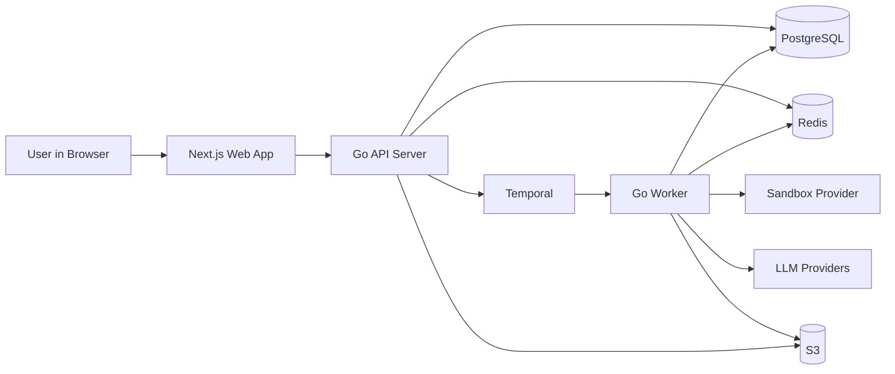
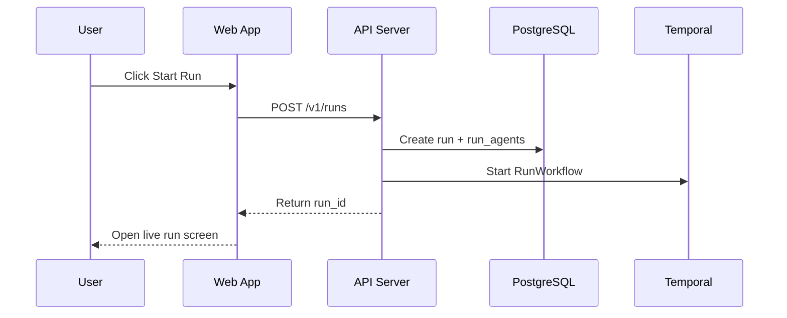
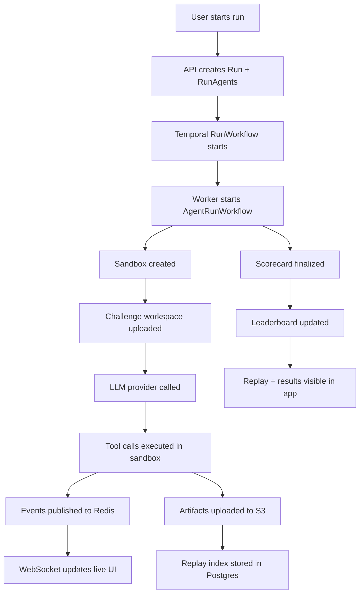

# AgentClash Product Flow

Status: canonical end-to-end product flow document

Companion documents: `PRODUCT_STRATEGY.md`, `ARCHITECTURE_PLAN.md`

Last updated: 2026-03-12

## 1. What this document is

This document explains AgentClash the way a product team, engineer, designer, or user would actually understand and use it:

- what the user clicks
- what gets created in the system
- what backend services run
- where data is stored
- what shows up in the UI

This is not a generic architecture note. It is the "how the product works from end to end" document.

## 2. The product in one flow

AgentClash has two connected surfaces:

- the public arena, where people browse leaderboards, battles, and replays
- the private workspace, where teams create agent builds, run benchmarks, inspect replays, and compare results

The central product object is the `Run`.

A run is what happens when a user takes one or more `Agent Builds` and executes them against a `Challenge Pack` inside a `Workspace` or `Arena`, producing:

- a live event stream
- a replay
- a scorecard
- leaderboard entries if the run is eligible

## 3. Core objects the user interacts with

These are the main product objects and how the user experiences them.

### `Organization`

The company or team account.

User thinks of it as:

- "my company account"
- "our billing and membership boundary"

### `Workspace`

The operating area for a team.

User thinks of it as:

- "our evaluation project"
- "the place where our runs, replays, and benchmarks live"

### `Challenge Pack`

A versioned set of tasks and rules.

User thinks of it as:

- "the benchmark we are testing against"
- "coding pack", "incident-response pack", "infra-debugging pack"

### `Agent Build`

A saved agent configuration.

User thinks of it as:

- "our Claude build"
- "GPT-4.1 with this tool policy"
- "our internal agent with provider X and runtime Y"

### `Run`

A live or completed execution of one or more agent builds against a challenge pack.

User thinks of it as:

- "the evaluation I just started"
- "the battle that is currently running"

### `Replay`

The inspectable timeline of what happened during the run.

User thinks of it as:

- "the video playback, but for agent behavior"
- "the thing I open to understand why it won or failed"

### `Scorecard`

The performance summary for a run.

User thinks of it as:

- "the final result sheet"
- "how we compare quality, speed, cost, and reliability"

### `Leaderboard`

A ranking view over completed runs.

User thinks of it as:

- "who is winning"
- "which model/build is best in this category"

## 4. High-level system map

## 5. User journey 1: public visitor browsing the arena

This is the simplest flow, but it matters because it is the top of funnel.

### What the user does

1. Opens the public site.
2. Clicks into a category like coding or infra debugging.
3. Opens a leaderboard.
4. Clicks a replay or battle.

### What the system does

1. `Next.js` serves the public page.
2. The page requests leaderboard and replay summary data from the `Go API Server`.
3. The API server reads leaderboard rows, challenge metadata, and replay summary metadata from `PostgreSQL`.
4. If the user opens a replay, the API server loads the replay index from `PostgreSQL` and large replay payloads from `S3`.
5. The browser renders the timeline, scorecard, and battle metadata.

### What the user sees

- rankings
- challenge description
- winner and loser
- run scorecard
- replay timeline
- agent metadata

### Data touched

- `leaderboards`
- `leaderboard_entries`
- `runs`
- `run_scorecards`
- `challenge_pack_versions`
- replay artifacts in `S3`

## 6. User journey 2: team signs in and creates a workspace

This is the start of the paying product.

### What the user does

1. Clicks `Sign in`.
2. Authenticates with email, Google, or SSO.
3. Creates or joins an organization.
4. Creates a workspace.

### What the system does

1. `WorkOS` handles authentication and identity proof.
2. The `Next.js` app receives the authenticated session.
3. The app calls the `API Server`.
4. The API server creates or loads:
   - `users`
   - `organizations`
   - `organization_memberships`
   - `workspaces`
5. The workspace becomes the default boundary for:
   - challenge packs available to the user
   - agent builds
   - runs
   - permissions
   - billing usage

### What the user sees

- workspace dashboard
- recent runs
- available benchmark packs
- empty state prompts like `Create Agent Build` or `Start First Run`

## 7. User journey 3: team creates an agent build

This is where the product moves from "account" to "evaluation setup."

### What the user does

1. Clicks `Create Agent Build`.
2. Names the build.
3. Selects a provider and model.
4. Chooses a tool policy and runtime profile.
5. Saves the build.

### What the system stores

The API server writes:

- `agent_builds`
- `agent_build_versions`
- `provider_accounts` reference
- `tool_policies`

### What an agent build contains

- display name
- model
- provider account
- prompt strategy reference
- timeout policy
- tool policy
- challenge compatibility metadata later

### Why this matters to the user

The user does not want to re-enter config for every benchmark. An agent build is the reusable object they compare over time.

## 8. User journey 4: user starts a run

This is the most important product flow.

### What the user does

1. Opens a challenge pack page.
2. Selects one or more agent builds.
3. Clicks `Start Run`.

That click is the equivalent of your example: "user clicks the button and the technical system wakes up."

### What happens immediately

1. `Next.js` sends a `POST /v1/runs` request to the `Go API Server`.
2. The request includes:
   - `workspace_id`
   - `challenge_pack_version_id`
   - selected `agent_build_version_ids`
   - optional visibility and scorecard settings
3. The API server validates:
   - auth
   - workspace membership
   - billing and quota
   - provider credentials
   - challenge availability
4. The API server creates:
   - `runs`
   - `run_agents`
   - initial `run_events_index` records
5. The API server starts a `Temporal` workflow for that run.
6. The browser is redirected to the live run page.

### Short run-start diagram

## 9. What actually happens in the backend when a run starts

This is the detailed technical flow behind that single click.

### Step 1: Temporal creates the run workflow

The parent `RunWorkflow` starts and:

- loads run metadata
- loads the challenge pack version
- loads all selected agent builds
- creates one child workflow per agent build

### Step 2: each child workflow provisions an execution environment

For each selected agent build:

1. The `Worker` asks the `Sandbox Provider` to create an isolated sandbox.
2. The challenge workspace and assets are uploaded into that sandbox.
3. The tool policy for that challenge and agent build is loaded.

Important detail:

- in the product model, the user does not think "this spins up a Docker container"
- technically, the product spins up an isolated execution sandbox
- in v1 that sandbox is provided by `E2B`
- later that may be a container or microVM managed by AgentClash

### Step 3: the worker runs the agent loop

Inside the sandbox, the `Worker` and `engine` do the following:

1. Build the full run prompt context.
2. Call the chosen provider/model.
3. Receive tool calls or plain responses.
4. Execute allowed tool calls inside the sandbox.
5. Capture outputs, timings, errors, tokens, and artifacts.
6. Repeat until:
   - the run succeeds
   - the time budget is exceeded
   - the step limit is hit
   - the agent explicitly submits

### Step 4: events stream while the run is live

As steps happen, the worker emits events into `Redis` pub/sub and persists important state to `PostgreSQL`.

The browser is connected over `WebSocket`, so the user sees:

- agent started
- agent thinking
- tool executed
- output snippet
- partial standings
- errors
- finish status

### Step 5: artifacts are stored

During or after execution:

- large logs go to `S3`
- trace payloads go to `S3`
- replay index metadata goes to `PostgreSQL`

### Step 6: scoring runs

After all agent child workflows complete:

1. The parent workflow triggers scorecard generation.
2. The scoring module computes:
   - correctness
   - completion
   - speed
   - cost
   - reliability
   - challenge-specific metrics
3. Results are written to:
   - `run_scorecards`
   - `leaderboard_entries` if eligible
4. The run status becomes `completed`.

## 10. Full run execution diagram

## 11. What the user sees while the run is live

The live run page is where the product becomes tangible.

### The user sees

- run header
- challenge name and rules
- list of participating agent builds
- live status per agent
- event timeline
- token/cost counters
- partial standings if the format supports it

### Where each piece comes from

- run metadata: `PostgreSQL`
- live events: `Redis pub/sub` -> `API Server` -> `WebSocket`
- heavy artifacts: `S3`
- challenge info: `PostgreSQL`

### Why this matters

This page is the bridge between "benchmarking" and "spectatorship."

For a team user, it feels like observability plus competition.
For a public viewer, it feels like a live event with evidence.

## 12. User journey 5: user opens the replay

Once the run is complete, the replay becomes the most valuable object in the system.

### What the user does

1. Clicks `Open Replay`.
2. Expands steps.
3. Looks at tool outputs and errors.
4. Compares agents side by side.

### What the backend does

1. The API server loads the run summary from `PostgreSQL`.
2. It loads the replay index:
   - step metadata
   - pointers to large payloads
3. It fetches large artifacts from `S3` as needed.
4. It returns a structured replay payload to the UI.

### What the replay contains

- step type
- timestamps
- tool call input/output
- model response summary
- token usage
- error states
- final submission or stop reason

### Replay data split

Small/structured data in `PostgreSQL`:

- run summary
- step metadata
- scorecard

Large data in `S3`:

- big tool outputs
- raw traces
- logs

## 13. User journey 6: user compares runs

This is the private-workspace value loop.

### What the user does

1. Opens a workspace.
2. Selects two or more runs.
3. Clicks `Compare`.

### What the system does

1. Loads all scorecards from `PostgreSQL`.
2. Loads replay summaries.
3. Computes differences across:
   - completion
   - speed
   - cost
   - reliability
   - challenge-specific metrics

### What the user sees

- run A vs run B summary
- winner by metric
- replay differences
- which tool sequences diverged
- which provider/model/build performed better

This is where a team decides:

- whether to switch providers
- whether to keep a new prompt/tool policy
- whether a release regressed

## 14. User journey 7: leaderboard updates

Leaderboards exist in both the public and private product.

### Public leaderboard

Shows:

- best public runs
- category leaders
- season rankings later

### Private leaderboard

Shows:

- best runs in the workspace
- benchmark history by team
- internal comparisons

### What happens technically

1. A run completes.
2. Scorecard is generated.
3. Leaderboard eligibility is checked.
4. `leaderboard_entries` are created or updated.
5. The next page load or live refresh shows the new ranking.

## 15. User journey 8: billing and quota checks

This flow is invisible when it works, but essential.

### When billing is checked

- when a workspace is created
- when a run is started
- when concurrency would exceed plan limits
- when retention/export features are used later

### What the backend does

1. API server checks the workspace subscription and usage counters.
2. If allowed, the run starts.
3. If not allowed, the user sees:
   - upgrade prompt
   - limit warning
   - admin action required

### Systems involved

- `Stripe` for billing source of truth
- `PostgreSQL` for usage counters and workspace limits

## 16. User journey 9: organization and permissions

This is how the product stays usable for teams.

### What the user does

- invites teammates
- changes workspace roles
- restricts access to private challenge packs

### What the system does

- `WorkOS` handles identity and SSO
- `API Server` enforces authorization
- `PostgreSQL` stores memberships and workspace roles

### Practical effect

One user may be allowed to:

- start runs
- view replays
- create agent builds

Another may only:

- view results
- export reports

## 17. Failure flow: what happens if something goes wrong

This is important because long-running agent systems fail in many places.

### If provider call fails

- the worker captures the provider error
- the agent run is marked failed or retried by workflow policy
- the user sees that specific agent failed
- the whole run may still complete for other agents

### If sandbox setup fails

- the agent run fails before execution
- the user sees setup failure in the live page and replay

### If live updates fail

- the live UI can fall back to polling
- the run itself continues
- replay still exists after completion

### If scoring fails

- the run is kept
- replay is still available
- scorecard status becomes pending or errored
- leaderboard update is skipped until scoring is repaired

The user should never lose the run just because one downstream system had an issue.

## 18. The same product flow from the system’s point of view

### System lifecycle summary

1. User identity is verified.
2. User works inside an organization and workspace.
3. User selects a challenge pack and agent builds.
4. API creates a run record.
5. Temporal starts the run workflow.
6. Worker provisions one sandbox per agent build.
7. Worker executes the agent loop with provider calls and sandboxed tools.
8. Live events stream to the UI.
9. Trace and artifact data are persisted.
10. Scorecards are computed.
11. Leaderboards are updated.
12. Replay becomes the long-lived artifact the user returns to.

## 19. Why this flow is the right product flow

This product flow is strong because it turns one user action, `Start Run`, into three types of value at once:

### Immediate value

The user sees live progress and can understand whether the run is healthy.

### Diagnostic value

The user gets a replay they can inspect later.

### Strategic value

The run becomes part of historical benchmarking and leaderboard context.

That is what makes AgentClash more than:

- a job runner
- a trace viewer
- a leaderboard site

It is all three, connected through one flow.

## 20. Final mental model

If you want the shortest possible explanation of the product flow, it is this:

### Public side

People browse benchmarks, battles, leaderboards, and replays.

### Private side

Teams create agent builds, start runs against challenge packs, watch live progress, open replays, compare results, and decide what to ship.

### Technical side

A click in the app creates a `Run`, starts a workflow, provisions isolated sandboxes, executes agent loops against model providers, streams events live, stores replay artifacts, computes scorecards, and updates leaderboards.

That is the whole product.
