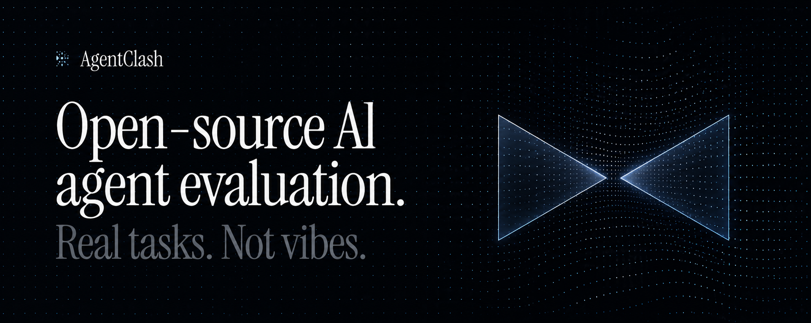

# AgentClash

Open-source AI agent evaluation for real tasks. AgentClash lets you race agents against the same workload, capture what they did, score the outcome, and turn failures into repeatable regression gates.

[Website](https://www.agentclash.dev) · [Docs](https://www.agentclash.dev/docs) · [CLI Distribution](docs/cli-distribution.md) · [Challenge Packs](docs/evaluation/challenge-pack-v0.md) · [CI Gates](web/content/docs/guides/ci-cd-agent-gates.mdx)

## What AgentClash Does

AgentClash is built for teams shipping agents, not leaderboard demos. It evaluates the whole run: the final answer, the tool choices, the artifacts, the latency, the cost, and the evidence trail that explains why one agent passed while another failed.

- Race multiple agents on the same task with the same tools and constraints.
- Define repeatable workloads with challenge packs.
- Watch runs live, then inspect transcripts, artifacts, replays, failures, and scorecards.
- Compare candidates against a saved baseline before release.
- Promote escaped failures into regression cases.
- Gate pull requests with the same evaluation workload you use during development.

## Product Surface

AgentClash gives you a workspace for the full evaluation loop:

| Area | What you use it for |
| --- | --- |
| Runs | Start and follow agent races across challenge packs and deployments. |
| Scorecards | Compare correctness, reliability, latency, cost, evidence, and pass/fail verdicts. |
| Replays | Review the step-by-step trajectory that produced the outcome. |
| Failures | Triage run failures and promote important ones into regression coverage. |
| Challenge packs | Package real tasks, inputs, validators, artifacts, and scoring rules. |
| Regression suites | Keep important failures covered across future model, prompt, and tool changes. |
| Compare and release gates | Decide whether a candidate is safe to ship against a baseline. |
| CI setup | Run AgentClash from GitHub Actions or another CI provider. |

 


 
 
 
 


## Quickstart

Install the CLI:

```bash
npm i -g agentclash
agentclash --help
```

Or run it without installing:

```bash
npx agentclash --help
```

Log in and choose a workspace:

```bash
export AGENTCLASH_API_URL="https://api.agentclash.dev"
agentclash auth login
agentclash link
```

If your workspace already has challenge packs and deployments, start your first evaluation:

```bash
agentclash eval start --follow
agentclash eval scorecard
```

## Run Your First Agent Race

AgentClash can guide you through available packs and deployments:

```bash
agentclash eval start --follow
```

For lower-level control, create a run directly:

```bash
agentclash run create --follow
agentclash run list
agentclash run transcript <run-id>
agentclash run scorecard <run-id>
```

For multi-turn human takeover while an agent waits for operator input:

```bash
agentclash run turn status <run-agent-id> --run <run-id>
agentclash run turn submit <run-agent-id> --run <run-id> --message "Your message here"
```

## Define A Challenge Pack

Challenge packs are how AgentClash turns real work into repeatable evals. A pack can describe the task, inputs, tools, expected artifacts, hidden grading rules, validators, and regression cases.

Create and publish a pack:

```bash
agentclash challenge-pack init support-eval.yaml
agentclash challenge-pack validate support-eval.yaml
agentclash challenge-pack publish support-eval.yaml
```

Run it:

```bash
agentclash eval start --pack support-eval --follow
```

Learn more in [Challenge Pack v0](docs/evaluation/challenge-pack-v0.md) and the examples in [docs/challenge-packs](docs/challenge-packs).

## Turn Failures Into Regression Tests

When an agent fails, AgentClash keeps the evidence around the failure: transcript, replay steps, artifacts, scorecard dimensions, and failure review metadata. Useful failures can become regression cases so the same mistake is tested again before the next release.

Typical workflow:

1. Run a pack against one or more candidate agents.
2. Inspect scorecards, replays, and failure details.
3. Promote important failures into a regression suite.
4. Re-run the suite whenever prompts, models, tools, or agent code changes.

> Screenshot placeholder: add a failure review or regression suite screenshot here.

## Gate Agent Changes In CI

AgentClash can compare a candidate run against a baseline and fail CI when the candidate regresses.

Create and validate a CI manifest:

```bash
agentclash ci init .agentclash/ci.yaml
agentclash ci validate .agentclash/ci.yaml --remote
```

Run the gate and write artifacts:

```bash
agentclash ci run \
  --manifest .agentclash/ci.yaml \
  --json \
  --artifact-dir agentclash-artifacts
```

Use the bundled GitHub Action:

```yaml
- id: agentclash
  uses: agentclash/agentclash/.github/actions/agentclash-ci@main
  with:
    token: ${{ secrets.AGENTCLASH_TOKEN }}
    workspace: ${{ secrets.AGENTCLASH_WORKSPACE }}
```

See [CI/CD Agent Gates](web/content/docs/guides/ci-cd-agent-gates.mdx) and [AgentClash CI for GitHub](docs/agentclash-ci-github.md).

## Common Commands

```bash
agentclash quickstart
agentclash workspace list
agentclash workspace use <workspace-id>
agentclash challenge-pack list
agentclash deployment list
agentclash eval start --follow
agentclash run list
agentclash run get <run-id>
agentclash run events <run-id>
agentclash run transcript <run-id>
agentclash run scorecard <run-id>
agentclash eval scorecard <run-id>
agentclash baseline set <run-id>
```

Run `agentclash --help` or `agentclash <command> --help` for the full command reference.

## Configuration

Use the hosted API unless you intentionally run your own backend:

```bash
export AGENTCLASH_API_URL="https://api.agentclash.dev"
export AGENTCLASH_TOKEN="..."
export AGENTCLASH_WORKSPACE="workspace-id"
```

API URL resolution order:

```text
--api-url > AGENTCLASH_API_URL > saved user config > default
```

## Local CLI Development

The CLI lives in `cli/` and can run against the hosted API:

```bash
export AGENTCLASH_API_URL="https://api.agentclash.dev"

cd cli
go run . auth login --device
go run . workspace list
go run . workspace use <workspace-id>
go run . eval start --follow
```

Before shipping CLI changes:

```bash
cd cli
go build ./...
go vet ./...
go test -short -race -count=1 ./...
```

## Docs

- [CLI Distribution](docs/cli-distribution.md)
- [Challenge Pack v0](docs/evaluation/challenge-pack-v0.md)
- [Agent Harnesses on Codex + E2B](docs/agent-harnesses-codex-e2b.md)
- [CI/CD Agent Gates](web/content/docs/guides/ci-cd-agent-gates.mdx)
- [Local API Development](docs/api-server/local-development.md)

## License

AgentClash is released under [FSL-1.1-MIT](https://fsl.software), the Functional Source License with an MIT Future License clause. See [LICENSE](LICENSE) for the full text.
