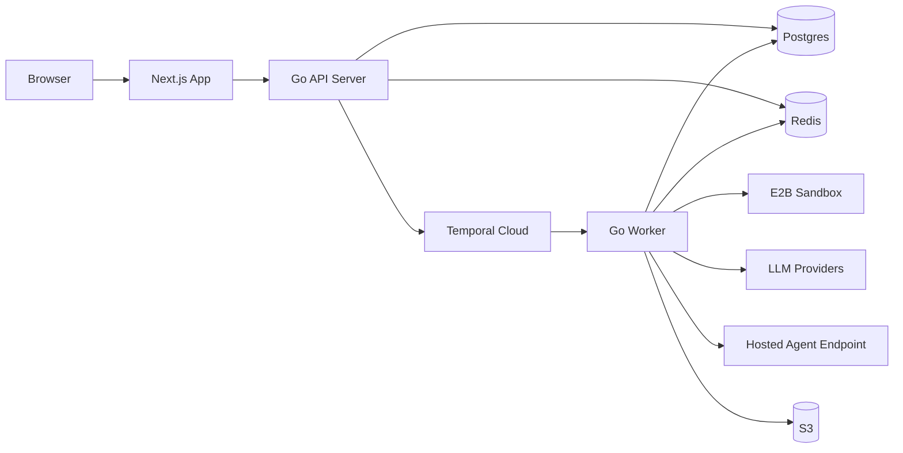
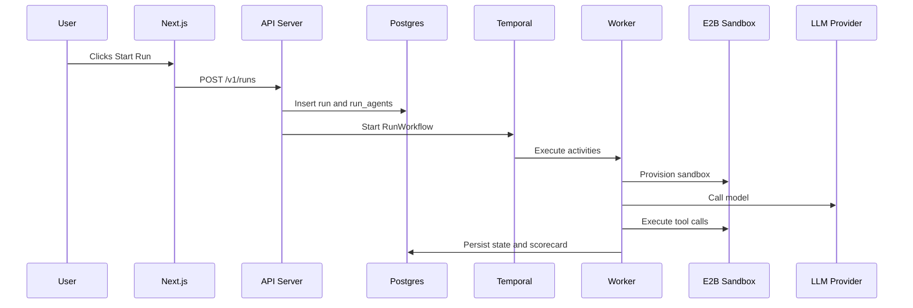
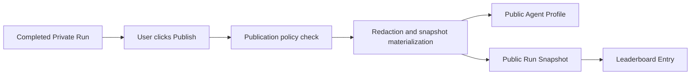

# AgentClash Architecture

Status: canonical architecture document

Last updated: 2026-03-12

## 1. Purpose

This document defines the actual system architecture AgentClash should be built around.

It is the implementation-facing architecture for AgentClash:

- AgentClash is a cloud-first B2B product with a public arena growth surface.
- The primary product unit is the `Agent Build` or `Agent Deployment`, not just the raw model.
- Private evaluation is the core value surface.
- Public content is a derived snapshot, not direct exposure of private workspace data.
- The system must support live execution, replay, scorecards, comparisons, and publication.

This file should be treated as the practical source of truth for:

- service boundaries
- infrastructure choices
- core data model
- runtime lifecycle
- security boundaries
- scale path from v1 onward

## 2. Product Architecture In One Paragraph

AgentClash is a two-plane system. The `control plane` owns organizations, workspaces, challenges, agent definitions, runs, billing, publication, and UI-facing APIs. The `execution plane` owns long-running benchmark execution, sandbox provisioning, provider calls, tool execution, event generation, replay assembly, and scoring. The browser talks to a `Next.js` app and `Go` API server. The API server persists product state in `PostgreSQL`, starts durable `Temporal` workflows, and serves live updates over WebSockets. `Go` workers execute native and hosted agent runs, provision isolated sandboxes through `E2B` for native builds, persist large artifacts to `S3`, publish live events through `Redis`, compute scorecards, and materialize public snapshots when a run is published.

## 3. Architecture Drivers

These requirements drive the architecture more than any framework preference.

### 3.1 Private by default

Team data, prompts, provider credentials, traces, and challenge inputs are private unless explicitly published.

### 3.2 Agent systems, not just models

The core comparison target is a full agent system:

- model
- provider
- prompt strategy
- tool policy
- runtime profile
- retrieval and memory behavior
- external hosted implementation details where applicable

### 3.3 Long-running, replayable execution

Runs are not request-response jobs. They may take minutes, stream events, generate artifacts, and require retries, cancellation, and resumability.

### 3.4 Fair benchmark execution

Every run needs:

- immutable eval pack version
- stable agent version or deployment config
- explicit runtime policy
- persisted scorecard methodology

### 3.5 Clear public/private separation

Private objects never become public in place. Public content is materialized into dedicated public objects.

### 3.6 Small-team operability

The v1 architecture must be strong enough for serious product use without forcing early Kubernetes, Kafka, or many microservices.

## 4. Core Product Mental Model

This architecture depends on one non-negotiable product model.

### 4.1 Canonical evaluation unit

AgentClash evaluates:

- `Agent Builds` for native in-platform definitions
- `Agent Deployments` for runnable native or externally hosted agents

It also records comparison dimensions:

- model
- provider
- tool policy
- runtime profile
- cost
- latency
- reliability

### 4.2 Public and private objects

Private objects:

- `Organization`
- `Workspace`
- `Eval Pack`
- `Eval Pack Version`
- `Agent Build`
- `Agent Build Version`
- `Agent Deployment`
- `Run`
- `Run Agent`
- `Replay`
- `Scorecard`

Public objects:

- `Public Agent Profile`
- `Public Run Snapshot`
- `Arena Submission`
- `Leaderboard Entry`

That separation is part of the architecture, not just a UI detail.

## 5. Recommended Tech Stack

## 5.1 Frontend

- `Next.js 15`
- `React 19`
- `TypeScript 5`
- `Tailwind CSS 4`
- `TanStack Query`
- native `WebSocket` client
- optional `Zustand` for local replay/live state
- `Sentry` for browser monitoring

Why:

- one stack can power public pages and authenticated workspace UI
- SEO matters for the public arena
- app-router SSR and streaming are useful for replay and leaderboard pages
- TypeScript remains the right language for the web surface

## 5.2 Backend

- `Go 1.25+`
- `chi` for HTTP routing
- `pgx` + `sqlc` for database access
- `goose` for migrations
- `Temporal Cloud` for workflows
- `Redis 7` for pub/sub, rate limits, and ephemeral state
- `PostgreSQL 17` as the source of truth
- `S3` for artifacts and replay payloads
- `WorkOS` for auth and org identity
- `Stripe` for billing and entitlements
- `E2B` as the v1 sandbox provider

Why:

- Go is the better fit for orchestration-heavy, concurrent, infra-facing backend work
- Temporal cleanly solves durable run orchestration
- PostgreSQL is the right primary product database
- Redis is enough for live fanout in v1
- S3 keeps large traces and artifacts out of relational storage

## 5.3 Infrastructure

- `Vercel` for the Next.js app
- `AWS ECS/Fargate` for `api-server` and `worker`
- `AWS RDS Postgres`
- `AWS ElastiCache Redis`
- `AWS S3`
- `Temporal Cloud`
- `WorkOS`
- `Stripe`
- `E2B`

Why not Kubernetes in v1:

- too much operational surface for the current stage
- ECS/Fargate is enough to scale API and worker tiers independently

Why not Kafka in v1:

- the hard problem is workflow durability, not very high-volume streaming
- Temporal plus Postgres plus Redis covers the actual v1 need

## 6. Logical Architecture



### 6.1 Control plane

The control plane owns product state and user-facing coordination:

- authentication
- authorization
- organizations and workspaces
- eval-pack catalog
- agent build management
- deployment registration
- run creation
- run metadata
- publication workflow
- leaderboard reads
- billing and entitlements

The control plane is mostly:

- `Next.js`
- `api-server`
- `Postgres`
- a thin slice of `Redis`

### 6.2 Execution plane

The execution plane owns benchmark execution:

- workflow progression
- retries and cancellations
- sandbox provisioning
- provider calls
- tool execution
- hosted-agent invocation
- live event emission
- replay assembly
- scorecard generation

The execution plane is mostly:

- `Temporal`
- `worker`
- `E2B`
- provider adapters
- replay/artifact persistence

## 7. Service Boundaries

## 7.1 Web app

Responsibilities:

- public arena pages
- workspace UI
- auth/session bootstrapping
- replay viewer
- leaderboard and comparison pages
- billing and settings pages

What it should not do:

- run benchmark logic
- store authoritative state
- orchestrate workflows directly

## 7.2 API server

Responsibilities:

- REST API for app and public reads
- session-aware authz
- object CRUD
- run submission
- WebSocket upgrade for live streams
- publication endpoints
- webhook handling for WorkOS and Stripe
- read models for leaderboard and replay summaries

What it should not do:

- execute tools
- make long-running provider calls
- own sandbox lifecycle

## 7.3 Workflow layer

`Temporal` is the durable state machine for run execution.

Responsibilities:

- start run workflows
- fan out one child path per `Run Agent`
- manage retries and backoff
- handle cancellation and timeout
- ensure durable progress across worker restarts

What it should not do:

- be used as the main product database
- store large artifacts

## 7.4 Worker service

Responsibilities:

- prepare challenge runtime
- invoke native or hosted execution paths
- manage sandbox usage for native builds
- call providers through adapters
- emit events
- persist artifacts
- compute scorecards
- finalize run states

What it should not do:

- expose the public API surface
- become the source of truth for product metadata

## 7.5 Sandbox provider

Responsibilities:

- isolate code-capable native runs
- hold temporary challenge workspace and file writes
- restrict capabilities according to tool policy

The engine should depend on a `sandbox abstraction`, not directly on E2B types.

## 8. Planned Monorepo Layout

```text
/web                    # Next.js app
/api-server             # Go API entrypoint
/worker                 # Go worker entrypoint
/internal
  /domain               # canonical domain models
  /repository           # db access and queries
  /workflow             # Temporal workflows and activities
  /provider             # provider adapters and policies
  /sandbox              # sandbox abstraction and E2B adapter
  /engine               # execution loop and tool orchestration
  /scoring              # scorecards and validators
  /replay               # event normalization and replay assembly
  /public               # public snapshot materialization
  /billing              # entitlements and usage accounting
  /auth                 # WorkOS integration and authz helpers
/db
  /migrations
  /queries
/skills                 # repo-local skills
```

The codebase should stay a monorepo until there is a real scaling reason to split it.

## 9. Canonical Data Model

## 9.1 Tenancy and access

### `organizations`

Fields:

- `id`
- `name`
- `billing_customer_id`
- `plan`
- `created_at`

### `users`

Fields:

- `id`
- `workos_user_id`
- `email`
- `display_name`

### `organization_memberships`

Fields:

- `id`
- `organization_id`
- `user_id`
- `role`

### `workspaces`

Fields:

- `id`
- `organization_id`
- `name`
- `slug`
- `visibility_default`

### `workspace_memberships`

Fields:

- `id`
- `workspace_id`
- `user_id`
- `role`

## 9.2 Benchmarks

### `eval_packs`

Fields:

- `id`
- `slug`
- `name`
- `family`
- `owner_type`
- `visibility`

### `eval_pack_versions`

Fields:

- `id`
- `eval_pack_id`
- `version`
- `runtime_policy`
- `scorecard_definition`
- `leaderboard_policy`
- `artifact_manifest_ref`

### `challenge_tasks`

Fields:

- `id`
- `eval_pack_version_id`
- `task_key`
- `prompt_payload_ref`
- `validator_config`
- `weight`

## 9.3 Agent system definitions

### `provider_accounts`

Fields:

- `id`
- `workspace_id`
- `provider_name`
- `credential_ref`
- `account_type`
- `status`

### `tool_policies`

Fields:

- `id`
- `workspace_id`
- `name`
- `policy_json`

### `runtime_profiles`

Fields:

- `id`
- `workspace_id`
- `name`
- `timeout_seconds`
- `max_cost_cents`
- `max_steps`

### `agent_builds`

Fields:

- `id`
- `workspace_id`
- `name`
- `description`
- `default_visibility`

### `agent_build_versions`

Fields:

- `id`
- `agent_build_id`
- `version`
- `model_name`
- `provider_account_id`
- `tool_policy_id`
- `runtime_profile_id`
- `config_json`

### `agent_deployments`

Fields:

- `id`
- `workspace_id`
- `build_version_id`
- `deployment_type`
- `base_url`
- `auth_secret_ref`
- `trace_mode`
- `status`

`deployment_type` in v1:

- `native`
- `hosted_external`

## 9.4 Execution

### `runs`

Fields:

- `id`
- `workspace_id`
- `eval_pack_version_id`
- `created_by_user_id`
- `status`
- `visibility`
- `publication_status`
- `temporal_workflow_id`

### `run_agents`

Fields:

- `id`
- `run_id`
- `agent_deployment_id`
- `status`
- `start_time`
- `end_time`
- `final_score`
- `cost_cents`
- `latency_ms`

### `run_events`

Fields:

- `id`
- `run_agent_id`
- `sequence_no`
- `event_type`
- `event_time`
- `event_json`

This table should store only normalized metadata and pointers. Large payloads belong in object storage.

### `replay_indexes`

Fields:

- `id`
- `run_agent_id`
- `summary_json`
- `artifact_index_json`
- `s3_prefix`

### `scorecards`

Fields:

- `id`
- `run_agent_id`
- `scorecard_json`
- `score_version`

## 9.5 Public materialization

### `public_agent_profiles`

Fields:

- `id`
- `workspace_id`
- `display_name`
- `description`
- `owner_label`
- `verification_status`

### `public_run_snapshots`

Fields:

- `id`
- `source_run_id`
- `source_run_agent_id`
- `public_agent_profile_id`
- `visibility`
- `snapshot_json`
- `replay_summary_ref`

### `arena_submissions`

Fields:

- `id`
- `public_run_snapshot_id`
- `eval_pack_version_id`
- `submission_status`
- `moderation_status`

### `leaderboard_entries`

Fields:

- `id`
- `eval_pack_version_id`
- `scope_type`
- `scope_key`
- `public_run_snapshot_id`
- `rank`
- `score`

## 10. Storage Model

## 10.1 PostgreSQL

Use Postgres for:

- product metadata
- tenancy
- permissions
- challenge metadata
- build and deployment metadata
- run state
- scorecards
- replay indexes
- public snapshots
- leaderboard materializations

## 10.2 S3

Use object storage for:

- full replay payloads
- large step logs
- sandbox artifacts
- challenge manifests and fixtures
- exported reports

Typical key layout:

```text
s3://agentclash-artifacts/
  eval-packs/{pack_id}/{version}/...
  runs/{run_id}/{run_agent_id}/events/...
  runs/{run_id}/{run_agent_id}/artifacts/...
  public-snapshots/{snapshot_id}/...
```

## 10.3 Redis

Use Redis for:

- WebSocket fanout
- live tail buffers
- short-lived replay cache
- rate limits
- concurrency guards

Do not treat Redis as the durable source of run truth.

## 11. Primary Runtime Flows

## 11.1 Private native run



Technical flow:

1. User selects a workspace, eval pack version, and one or more agent deployments.
2. API server validates authz, plan limits, challenge visibility, and deployment compatibility.
3. API writes `runs` and `run_agents` in `queued` state.
4. API starts a Temporal workflow and stores the workflow ID on the run.
5. Worker provisions one sandbox per native run agent.
6. Worker uploads challenge assets and runtime metadata into the sandbox.
7. Worker runs the execution loop:
   - prepare prompt and state
   - call provider adapter
   - execute allowed tools
   - emit normalized events
8. Worker persists normalized event metadata to Postgres and large event blobs to S3.
9. Worker computes final scorecards and finalizes `run_agents`.
10. Run status becomes `completed`, `failed`, or `completed_with_errors`.

## 11.2 Hosted external run

Hosted external agents are required because many customers will already have deployed agents.

Flow differences:

- no AgentClash-managed sandbox is required unless the benchmark policy demands a proxy wrapper
- worker calls the customer endpoint rather than executing the internal agent loop
- trace depth depends on supported mode

Supported v1 modes:

- `black_box`
- `structured_trace`

`black_box` contract:

- AgentClash sends benchmark input
- customer returns final answer, status, latency, optional metadata

`structured_trace` contract:

- customer also returns standardized trace events such as:
  - `model_call_started`
  - `model_call_finished`
  - `tool_called`
  - `tool_result`
  - `retrieval_hit`
  - `final_answer`

## 11.3 Publication flow



Flow rules:

- publication is opt-in
- publication happens per run or per run agent, not per workspace
- publication creates new public objects
- provider credentials, private prompts, raw private traces, and tenant-specific artifacts never move into public objects

## 12. Event Model And Replay

The replay system is one of the product’s primary differentiators, so event design must be consistent from day one.

### 12.1 Canonical event types

- `run_started`
- `run_progressed`
- `model_call_started`
- `model_call_finished`
- `tool_called`
- `tool_result`
- `retrieval_hit`
- `judge_step`
- `artifact_created`
- `final_answer`
- `run_finished`
- `run_failed`

### 12.2 Event pipeline

1. Worker emits normalized events.
2. Event metadata is written to Postgres.
3. Large payloads are written to S3.
4. Live event summaries are published through Redis.
5. API server fans those updates to WebSocket subscribers.
6. Replay viewer loads the replay index from Postgres and fetches large payloads lazily.

### 12.3 Replay design rules

- event schema versioning must be explicit
- timestamps and sequence numbers must be stable
- public replay snapshots should be derived from the same normalized event model
- replay pages should not require raw worker logs

## 13. Provider And Tooling Architecture

## 13.1 Provider abstraction

Provider adapters should normalize:

- model invocation
- streaming responses
- tool-call shape
- usage accounting
- provider-specific errors
- timeout and retry rules

Provider adapters belong in the worker codebase in v1. They do not need to be a separate network service yet.

### 13.2 Provider account model

Support both:

- platform-managed provider accounts
- bring-your-own-key accounts

Credentials should be stored as encrypted secret references, not raw secrets in product tables.

## 13.3 Tool policy model

Every challenge run should use an explicit tool policy that defines:

- allowed tools
- allowed network policy
- filesystem permissions
- command execution policy
- step, time, and cost budgets

This is how AgentClash keeps comparisons fair and sandbox behavior predictable.

## 14. Sandbox Architecture

## 14.1 Why sandboxing exists

Native builds may need:

- file I/O
- command execution
- generated artifacts
- code patching or test running

Those actions should never happen on the API host or worker host filesystem.

## 14.2 Sandbox rules

- one sandbox per run agent
- challenge inputs mounted or uploaded per run
- outbound network disabled by default
- tool policy controls which capabilities are enabled
- sandbox lifetime is tied to the run agent lifecycle

## 14.3 Replaceable abstraction

The engine should depend on a small interface such as:

- `CreateSandbox`
- `UploadArtifacts`
- `Execute`
- `DownloadArtifacts`
- `DestroySandbox`

That keeps E2B replaceable if the cost curve eventually forces a self-managed runtime.

## 15. Scoring And Evaluation Architecture

Scoring should be eval-pack-driven, not hardcoded globally.

Every eval pack version defines:

- validator type
- metric weights
- score normalization
- leaderboard eligibility
- publication policy

Scorecard dimensions should usually include:

- correctness
- task completion
- latency
- cost
- reliability
- rule-specific metrics such as citation quality or test pass rate

The scoring system should output both:

- machine-readable structured scorecards
- UI-friendly summary objects

## 16. Public Arena Architecture

The public arena should be treated as a read-optimized view over curated public material, not the live source of operational truth.

### 16.1 Public data rules

Public pages can read:

- leaderboard entries
- public agent profiles
- public run snapshots
- redacted replay summaries

Public pages cannot read:

- private workspace runs
- raw provider configs
- tenant secrets
- unpublished traces

### 16.2 Official vs community split

Even if community submissions are added later, keep them distinct from official benchmark credibility.

Recommended public scopes:

- `official`
- `community`
- `private_unlisted_share`

## 17. API Shape

Use REST in v1.

### 17.1 Example API groups

- `/v1/workspaces`
- `/v1/eval-packs`
- `/v1/agent-builds`
- `/v1/agent-deployments`
- `/v1/runs`
- `/v1/replays`
- `/v1/scorecards`
- `/v1/public/leaderboards`
- `/v1/public/runs`
- `/v1/public/agents`

### 17.2 Realtime

- `GET /v1/runs/{id}`
- `GET /v1/runs/{id}/agents`
- `GET /v1/replays/{runAgentId}`
- `GET /v1/scorecards/{runAgentId}`
- `WS /v1/runs/{id}/stream`

### 17.3 Hosted external contract

For hosted external deployments, AgentClash should expose a clear execution contract document. The first implementation can be JSON over HTTPS with signed bearer auth.

## 18. Security And Compliance Baseline

V1 baseline:

- WorkOS-backed authentication
- role-based authorization
- encrypted provider credentials using cloud KMS-backed secret storage
- tenant-isolated workspace queries
- sandboxed native execution
- publication redaction path
- immutable eval pack versions for auditability

Security defaults:

- private by default
- no direct provider key exposure in UI or public objects
- sandbox outbound network disabled unless challenge policy allows it
- all public content derived from explicit publication

## 19. Observability And Operations

Minimum observability stack:

- structured JSON logs
- metrics for API latency, queue depth, workflow failures, sandbox startup time, provider latency, run duration, replay generation time
- traces across API submission to worker completion
- Sentry for frontend and backend error capture if desired

Key operational dashboards:

- run throughput
- run failure rate by eval pack
- provider error rate by provider/model
- sandbox provisioning latency
- worker concurrency saturation
- public publication backlog

## 20. Deployment Topology

### 20.1 Local development

- Next.js app locally
- API server locally
- worker locally
- Postgres and Redis via Docker Compose
- Temporal local dev server or Temporal Cloud dev namespace

### 20.2 Staging

- Vercel preview app
- ECS/Fargate API and worker
- small RDS and Redis instances
- Stripe test mode
- WorkOS test tenant
- E2B sandbox budget cap

### 20.3 Production

- Vercel for web
- ECS/Fargate service for API server
- ECS/Fargate service for worker
- autoscaling worker based on queue depth and workflow pressure
- RDS Postgres Multi-AZ
- ElastiCache Redis
- S3 artifact bucket
- Temporal Cloud

## 21. Scale Path

This architecture should scale in phases.

### Phase 1

- single API service
- single worker service
- Postgres
- Redis
- S3
- Temporal

### Phase 2

When replay analytics and public traffic grow:

- add read replicas
- add dedicated public read models
- add materialized leaderboard jobs
- add CDN caching for public replay summaries

### Phase 3

When event volume becomes analytically important:

- introduce `ClickHouse` for replay analytics and reporting
- keep Postgres as the operational database

### Phase 4

When sandbox costs dominate:

- evaluate self-managed runtime pools or Firecracker-based workers
- keep the sandbox abstraction stable so the rest of the system does not need a rewrite

## 22. Explicit Non-Goals

Do not build these into v1:

- Kubernetes-first platform ops
- Kafka-centric event platform
- gRPC-first internal architecture
- user-authored workflow graph builder
- arbitrary custom challenge authoring for everyone
- public object model that directly exposes private workspace state

## 23. Final Recommendation

The right architecture for AgentClash is:

- `Next.js` for the product surface
- `Go` for the API server and worker plane
- `PostgreSQL` as the source of truth
- `Redis` for live fanout and ephemeral coordination
- `Temporal` for durable run orchestration
- `S3` for replay and artifact storage
- `E2B` for native sandboxing in v1
- `WorkOS` for auth
- `Stripe` for billing
- `AWS ECS/Fargate` plus `Vercel` as the deployment baseline

The most important architectural decision is not the exact framework list. It is the system boundary:

Keep the control plane and execution plane separate, keep public data derived from private state, and make `Run -> Replay -> Scorecard -> Leaderboard` the core data pipeline of the product.
