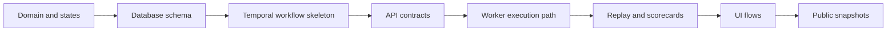

# Build Order

Status: practical implementation sequence for v1

Purpose: keep the team and future coding agents aligned on what to build first, what depends on what, and where not to jump ahead.

This is intentionally short. It is not a second architecture doc.

## Core Rule

Build the system in the same order that responsibility flows through it:

`domain -> database -> workflow -> API -> worker -> replay -> UI -> publication`

If this order is reversed, the codebase usually becomes noisy fast.

## High-Level Flow

## Step 1: Lock the Core Domain

Define the backend nouns first:

- `Organization`
- `Workspace`
- `ChallengePack`
- `ChallengePackVersion`
- `AgentBuild`
- `AgentDeployment`
- `Run`
- `RunAgent`
- `Replay`
- `Scorecard`
- `PublicRunSnapshot`

Also define the important state machines:

- `Run`: `draft -> queued -> provisioning -> running -> scoring -> completed | failed | cancelled`
- `RunAgent`: `queued -> ready -> executing -> evaluating -> completed | failed`

Why this comes first:

- the DB depends on it
- the workflow depends on it
- the API depends on it

Output of this step:

- stable domain terms
- stable status enums
- ownership of each object
- first domain map in [`docs/domains/domains.md`](../domains/domains.md)

## Step 2: Design the Database

Create the minimum durable schema around those objects.

Start with:

- tenancy tables
- challenge-pack tables
- agent-build and deployment tables
- run and run-agent tables
- replay index tables
- scorecard tables
- public snapshot tables

Important rule:

- `Postgres` is the source of truth
- `Redis` is not
- `Temporal` is not
- `S3` is for large payloads, not relational truth

Output of this step:

- migrations
- query layer shape
- primary foreign keys and indexes
- first database rulebook in [`docs/database/rule.md`](../database/rule.md)

## Step 3: Build the Run Workflow Skeleton

Before building real handlers, make the workflow lifecycle real.

Start with:

- create `RunWorkflow`
- create one child path per `RunAgent`
- add status transitions
- add timeout, cancellation, and retry behavior

Do not add full provider logic yet. First make sure the workflow can move a run from `queued` to `completed` with fake activities.

Output of this step:

- durable execution backbone
- clear worker responsibilities
- stable place to attach real execution later

## Step 4: Add the API Layer

Now expose the smallest useful API.

Start with:

- `POST /v1/runs`
- `GET /v1/runs/{id}`
- `GET /v1/runs/{id}/agents`
- `GET /v1/replays/{runAgentId}`
- `GET /v1/scorecards/{runAgentId}`

The API server should:

- validate auth and workspace access
- insert DB records
- start Temporal workflows
- return current run state

The API server should not:

- run benchmark logic
- own tool execution
- hold long-running execution state in memory

Output of this step:

- working control-plane entrypoint
- clear contract for frontend and internal testing

## Step 5: Build the Worker Execution Path

Once the workflow and API exist, plug in actual execution.

Build in this order:

1. hosted external agent execution
2. provider adapter layer
3. native execution loop
4. sandbox integration

That order matters because hosted execution is simpler and proves the run lifecycle without sandbox complexity.

Worker responsibilities:

- pick up workflow activities
- call hosted endpoints or provider adapters
- emit normalized events
- persist run progress

Output of this step:

- first real benchmark runs
- first usable execution pipeline

## Step 6: Add Replay and Scorecards

Once runs execute, make them inspectable.

Build:

- normalized event schema
- event persistence
- replay index builder
- scorecard generator

Rule:

- store large logs and artifacts in `S3`
- store replay index and summary data in `Postgres`

Output of this step:

- users can understand what happened
- runs become comparable instead of just executable

## Step 7: Build the UI Around One Complete Flow

Do not build broad UI first. Build one full path:

1. choose workspace
2. choose challenge pack
3. choose agent deployment
4. start run
5. watch run
6. open replay
7. inspect scorecard

This proves the product loop without needing the whole app surface.

Output of this step:

- first end-to-end usable product slice

## Step 8: Add Publication and Public Read Models

Only after private execution works well:

- add publish action
- materialize `PublicRunSnapshot`
- materialize leaderboard entries
- expose public read endpoints

Important rule:

- public content is derived from private runs
- private objects never become public in place

Output of this step:

- safe public arena foundation

## Step 9: Harden and Expand

After the core loop works:

- add billing and entitlements
- add rate limits and quotas
- add provider budget controls
- add better replay UX
- add native sandbox hardening
- add ops dashboards and alerts

This is where scale and polish happen. It should not be the starting point.

## What Connects To What

- domain definitions drive DB shape
- DB shape drives workflow persistence
- workflow drives worker responsibilities
- API starts and reads workflow-backed state
- worker produces events
- replay and scorecards are built from events
- UI reads API state and replay summaries
- public arena reads derived public snapshots

## What Not To Do First

- do not start with a huge frontend
- do not start with generic abstractions everywhere
- do not start with public arena features before private runs work
- do not start with sandbox-heavy native execution before hosted execution proves the flow
- do not make Redis or in-memory state the source of truth

## Recommended First Vertical Slice

If the team wants one exact first slice, it should be:

1. create workspace
2. register one hosted external agent
3. start one run on one official challenge pack
4. execute through Temporal and worker
5. persist run state
6. generate replay summary
7. generate scorecard
8. display the result in the app

That is the smallest slice that proves the system is real.
