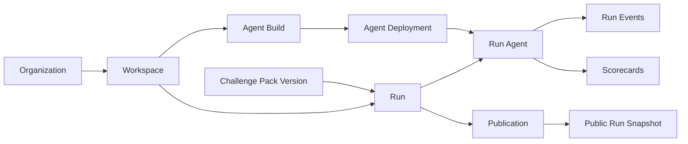
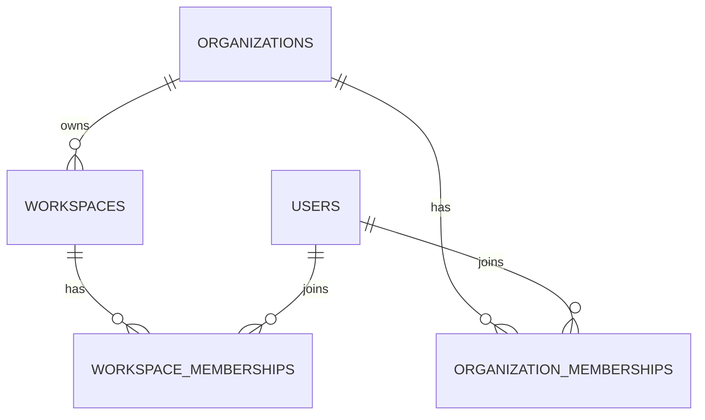
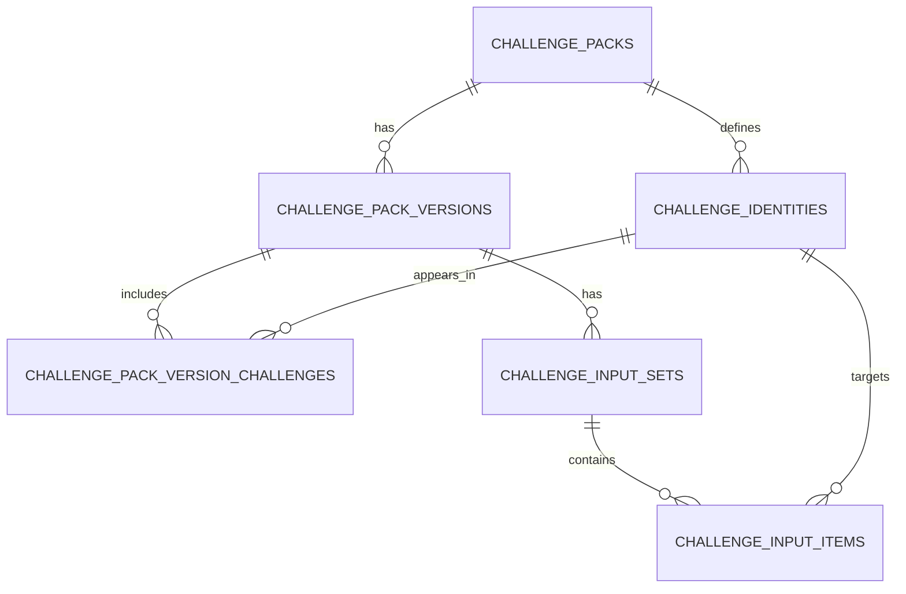
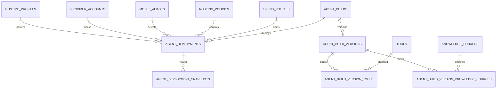
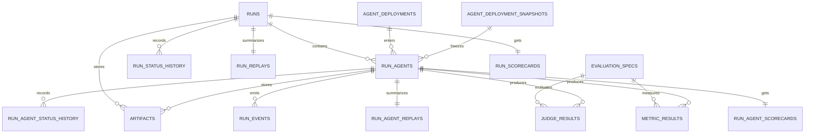
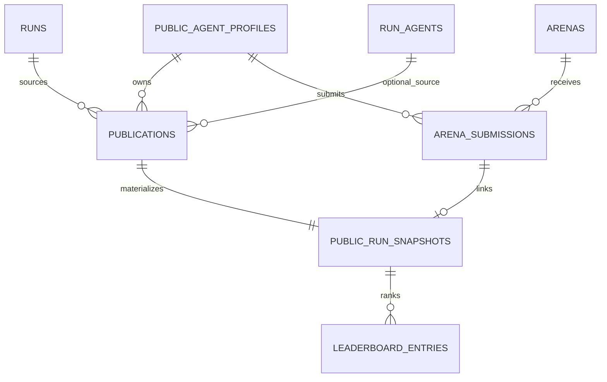

# Database Schema Diagram

Purpose: explain the current database in one place, visually and in product terms.

This doc matches the actual migration set in [`backend/db/migrations`](../../backend/db/migrations), not just the planning docs.

## 1. The Main Spine

This is the shortest way to understand the whole schema:

Mental model:

- `Organization` is the billing and ownership root.
- `Workspace` is the private operating boundary.
- `Agent Build` is the thing the customer defines.
- `Agent Deployment` is the runnable target.
- `Run` is one benchmark experiment.
- `Run Agent` is one participant inside that run.
- telemetry, replay, and scorecards hang off `Run Agent`.
- public content is derived later through `Publication`.

## 2. Tenancy And Ownership

These tables define who owns private data.

Rule:

- private data is always scoped through `organization_id` and usually `workspace_id`
- the schema now enforces that runs, deployments, artifacts, and publications stay in the right tenant path

## 3. Challenge Catalog

This part answers “what exactly is being tested?”

Mental model:

- `Challenge Pack` is the long-lived benchmark family
- `Challenge Pack Version` freezes a runnable benchmark
- `Challenge Identity` is the stable identity of one challenge across versions
- `Challenge Input Set` freezes the input corpus used by a run

## 4. Agent And Provider Layer

This part answers “what system is being evaluated?”

Mental model:

- `Agent Build` is the customer-facing definition
- `Agent Build Version` is the immutable version of that definition
- `Tool` and `Knowledge Source` are reusable platform resources
- `Agent Deployment` is the live runnable target
- `Agent Deployment Snapshot` freezes the exact execution context used by a run

Important DB rule:

- deployments and snapshots are now tenant-validated against their runtime/provider dependencies
- a deployment cannot point at another tenant’s runtime profile, provider account, or policy

## 5. Run, Replay, And Scoring

This is the execution core.

Mental model:

- `Run` is the whole experiment envelope
- `Run Agent` is one lane inside that experiment
- raw telemetry lands in `run_events`
- replay tables are indexed summaries, not the raw trace itself
- `run_agent_scorecards` score each participant
- `run_scorecards` summarize the comparison outcome

## 6. Public Projection

Public data is derived from private data. It is not the same row becoming public.

Mental model:

- `Publication` is the deliberate act of exposing a private result
- `Public Agent Profile` is the public identity, separate from private build/deployment rows
- `Public Run Snapshot` is the sanitized public result
- `Leaderboard Entry` is a derived ranking record inside an `Arena`

Important DB rule:

- publications are tenant-bound to the same `Run` they came from
- public objects keep provenance without exposing private tables in place

## 7. Migration Layout

The current files are intentionally grouped by domain:

1. [`00001_extensions_and_helpers.sql`](../../backend/db/migrations/00001_extensions_and_helpers.sql)
2. [`00002_identity_and_tenancy.sql`](../../backend/db/migrations/00002_identity_and_tenancy.sql)
3. [`00003_challenge_catalog.sql`](../../backend/db/migrations/00003_challenge_catalog.sql)
4. [`00004_provider_infrastructure.sql`](../../backend/db/migrations/00004_provider_infrastructure.sql)
5. [`00005_agent_registry.sql`](../../backend/db/migrations/00005_agent_registry.sql)
6. [`00006_run_orchestration.sql`](../../backend/db/migrations/00006_run_orchestration.sql)
7. [`00007_replay_and_scoring.sql`](../../backend/db/migrations/00007_replay_and_scoring.sql)
8. [`00008_publication_and_arena.sql`](../../backend/db/migrations/00008_publication_and_arena.sql)

That order is the implementation order too:

`tenancy -> challenge catalog -> agent definition -> execution -> replay/scoring -> public projection`
