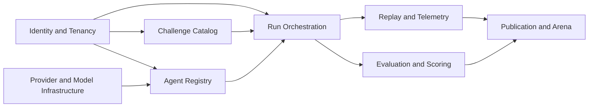

# Domains

Status: first-pass canonical domain map

Purpose: define the core product domains before database, API, workflow, and service design.

This file is intentionally short. It is not a second architecture doc.

## Core Rule

Domains are ownership boundaries for business rules and state transitions.

They are not the same thing as:

- services
- packages
- tables
- APIs

In v1, several domains may live inside the same backend service. That is fine. The important part is that each important noun has one primary owner.

## Canonical Product Nouns

These are the product nouns that should survive future rewrites:

- `Organization`
- `Workspace`
- `Challenge Pack`
- `Agent Build`
- `Agent Deployment`
- `Run`
- `Replay`
- `Scorecard`
- `Publication`

These are the external nouns the product should consistently speak in.

## Core Domain Map

### 1. Identity and Tenancy

Owns:

- `Organization`
- `Workspace`
- `Membership`
- `Role`

Responsibilities:

- org and workspace boundaries
- who can see what
- workspace-level access control
- ownership of private data boundaries

Answers:

- who is the customer
- which workspace owns this object
- which user can create, run, publish, or inspect

This domain is the root of the private product.

### 2. Challenge Catalog

Owns:

- `Challenge Pack`
- `Challenge Pack Version`
- `Challenge`
- `Challenge Identity`
- `Challenge Input Set`

Responsibilities:

- benchmark catalog and metadata
- immutable challenge-pack versioning
- packaging of tasks and task inputs
- separately addressable challenge identities within a pack version
- challenge family and category definitions
- challenge-level execution requirements

Answers:

- what is being tested
- which benchmark version was used
- which exact challenge inside the pack a result belongs to
- what inputs, rules, and environment the run must use

This is a core product domain, not just test data.

Important decision:

- a `Challenge Pack Version` is not just one sealed blob
- each `Challenge` inside the pack must have its own addressable identity

Reason:

- runs, scorecards, replays, and leaderboards may need challenge-level references
- challenge-level comparison is a core product need, not a reporting afterthought

### 3. Agent Registry

Owns:

- `Agent Build`
- `Agent Build Version`
- `Agent Deployment`
- `Tool`
- `Knowledge Source`
- `Runtime Profile`

Responsibilities:

- agent definition and versioning
- build-to-deployment relationship
- reusable tools and tool policies
- reusable knowledge sources and data attachments
- runtime settings such as timeout, memory mode, and execution profile
- deployment snapshots used by real runs

Answers:

- what exactly is being evaluated
- which tools and knowledge resources the agent can use
- whether the run targets a native build or hosted external deployment

Important decisions:

- `Agent Build` and `Agent Deployment` are separate first-class concepts
- `Tool` is a first-class reusable object
- `Knowledge Source` is also a first-class reusable object
- tools should be centrally defined and then bound into builds
- knowledge sources should support both organization scope and workspace scope
- runs should point at an immutable deployment snapshot, not a floating mutable deployment

Reason:

- multiple builds should be able to share tools and knowledge sources
- multiple deployments may point at the same build version
- external hosted agents need a deployment-level identity even when internals are partly opaque
- tools and knowledge assets are reusable platform resources, not one-off config blobs
- org-level knowledge reuse is important for larger teams, while workspace scope preserves isolation where needed
- historical runs must remain reproducible even after deployment changes

### 4. Provider and Model Infrastructure

Owns:

- `Provider Account`
- `Model Catalog`
- `Model Alias`
- `Routing Policy`
- `Spend Policy`

Responsibilities:

- provider credentials and account bindings
- model availability and model metadata
- rate limits and concurrency policy
- routing and fallback policy
- cost and provider-level control surfaces

Answers:

- which provider/model a build or deployment uses
- what limits and routing rules apply
- how spend and provider risk are controlled

This is separate from the agent domain because providers are shared infrastructure, not agent identity.

### 5. Run Orchestration

Owns:

- `Run`
- `RunAgent`
- `Run State`
- `Execution Plan`

Responsibilities:

- creation and lifecycle of benchmark runs
- turning one run request into one or many runnable agent entries
- queueing, scheduling, execution state, cancellation, and retries
- mapping challenge versions and agent deployments into an executable plan
- enforcing fairness for multi-agent comparisons inside the same run

Answers:

- what is running right now
- which agents are part of this run
- what state each agent entry is in
- whether the run completed, failed, or was cancelled

Canonical meaning:

- a `Run` is an experiment envelope
- a `Run` can contain one or many `RunAgent` entries
- each `RunAgent` is one participating agent/deployment attempt against the selected challenge pack version
- all `RunAgent` entries inside a single `Run` should share the same challenge-pack version and challenge input set

This supports both:

- one agent on one challenge
- many agents compared on the same challenge

### 6. Replay and Telemetry

Owns:

- `Run Event`
- `Replay`
- `Artifact`
- `Live Run Stream`

Responsibilities:

- normalized event schema
- step, tool, retrieval, and model-call telemetry
- replay assembly and replay indexing
- live event fanout
- storage of logs, traces, and artifacts
- aggregate experiment playback across multiple agent entries

Answers:

- what happened during the run
- what the agent did step by step
- what the user can watch live
- what can be replayed later

Important decision:

- trace-aware agents are the first-class path
- black-box agents are supported only as a limited-observability mode
- replay should exist both per `RunAgent` and as an aggregate `Run Replay`

Reason:

- telemetry and replay are core product value
- pure final-answer-only evaluation is useful for compatibility, but weak for diagnosis and trust
- users need a per-agent debug view and a whole-run comparison view

### 7. Evaluation and Scoring

Owns:

- `Evaluation Spec`
- `Judge Result`
- `Metric Result`
- `Scorecard`
- `Comparison`

Responsibilities:

- validators and judge execution
- rubric-driven scoring
- LLM-as-judge support where appropriate
- metric normalization
- scorecard generation
- comparison outputs across runs, agents, models, or providers
- summary scoring across the whole experiment envelope

Answers:

- how performance is measured
- why one agent won
- how runs can be compared fairly

Important decision:

- scoring is its own reusable domain
- it is not just a small tail step of the run domain
- scorecards should exist both per `RunAgent` and at the parent `Run` comparison level

### 8. Publication and Arena

Owns:

- `Publication`
- `Official Arena`
- `Community Arena`
- `Public Agent Profile`
- `Public Run Snapshot`
- `Arena Submission`
- `Leaderboard Entry`

Responsibilities:

- publication workflow from private to public
- sanitization and projection of private results into public objects
- official arena submission handling
- community arena submission handling
- public leaderboard materialization
- mapping private builds and deployments to public-facing identities

Answers:

- what becomes public
- how a private run turns into public content
- which content is official, community, verified, or unpublished

Important decisions:

- public and private are separate domains
- public content is derived, not exposed in place
- both `Publication` and `Arena Submission` should exist as first-class nouns
- `Official Arena` and `Community Arena` should be treated as separate concepts
- public content should point to a derived `Public Agent Profile`, not private build or deployment objects

Reason:

- publication is a product workflow
- arena participation is not identical to “this run is public”
- official benchmark credibility and open community participation should not share the same trust model
- public identity must stay stable and safe even if private implementation details change

## Supporting Domains

These matter, but they are not the first domain-design priority.

### Billing and Quotas

Owns:

- usage metering
- workspace quotas
- plan entitlements
- billing state

This is a supporting platform domain for now, not a core product pillar.

### Audit and Compliance

Owns:

- audit events
- retention policy references
- compliance-facing access history

This will matter more as enterprise requirements grow.

## Domain Relationships

Interpretation:

- identity gates all private ownership
- challenge and agent domains feed the run domain
- provider infrastructure supports agent definitions and execution policy
- runs produce telemetry and score outputs
- publication consumes replay and score outputs to produce public objects

## Boundary Decisions Locked In

- AgentClash evaluates `Agent Builds` and `Agent Deployments`, not just raw models
- `Agent Build` and `Agent Deployment` stay separate
- `Challenge Pack` is a core product domain
- `Tool` is a first-class reusable object
- `Knowledge Source` is a first-class reusable object
- providers live in a separate domain from agents
- scoring is a reusable domain with judge support
- public and private remain separate domains
- `Publication` and `Arena Submission` both exist
- black-box agents are supported, but only as a limited-observability path

## What Comes Next

The next documents should derive from this file in order:

1. state machines
2. database schema
3. API contracts
4. workflow design

If those are designed before this domain map is stable, the codebase will drift early.
