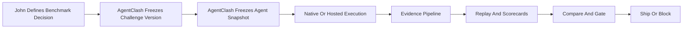
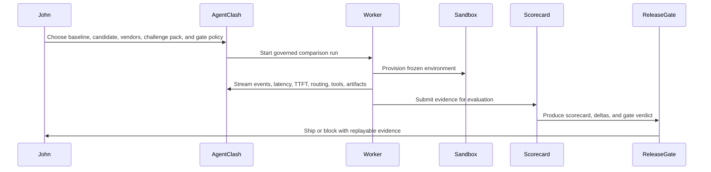

# Enterprise User POV — Future Vision

Status: **v3 vision doc — not current roadmap.** Moved from `docs/product/` on 2026-04-21 as part of the v1 refocus on engineer dev-tool positioning. See `docs/ROADMAP.md` for the v1/vNext/v3 split and what drives roadmap today vs later.

Last updated: 2026-03-15

Purpose: show how the best version of AgentClash should feel to a large-enterprise buyer, and why it solves a decision problem that observability-only or eval-only products leave fragmented. **This is where AgentClash is aimed in 2–3 years once the bottom-up engineer wedge has earned pull upmarket. It is not a brief for what to build next quarter.**

Note on competitor references: the positioning links in this doc were checked on 2026-03-15 and reflect how those products currently describe themselves publicly.

## The User

John Menon is the head of AI platform at a global enterprise.

He is not trying to win a demo.
He is trying to answer five questions before a release goes live:

- Which agent should we trust?
- Under which runtime constraints?
- At what cost?
- Why did it fail when it failed?
- Can I defend this decision to security, finance, and engineering leadership?

That is the real job.

## The Problem John Has Before AgentClash

John already uses good tools.

- He can get traces.
- He can run evals.
- He can inspect prompts.
- He can review incidents after the fact.

But his actual decision loop is still broken.

He still has to stitch together:

- one system for traces
- another for evals
- another for sandboxed execution
- another for internal release policy
- another for executive reporting

That is where most "AI quality" tooling stops being enough for a big enterprise.

John does not need one more dashboard.
He needs a system that turns agent behavior into a governed decision artifact.

## What The Best Agentic Testing Software Feels Like

The best version of AgentClash should feel like this:

- John brings native internal agents and hosted vendor agents into one controlled benchmark.
- Every run happens against an immutable environment and challenge version.
- Every meaningful action becomes evidence: routing, TTFT, latency, retries, tool calls, artifacts, failure modes, judge results, and scorecards.
- Replay is not a debug log. It is the explanation layer for why an agent won or failed.
- Comparison is not an afterthought. It is the main screen.
- Release gating is not external. It is built from the same benchmark evidence.
- Private by default is non-negotiable, but John can publish redacted proof when he wants leverage with vendors or leadership.

## The Story

### 1. Monday morning: John has a release problem

John's team has a new coding agent release candidate.

The candidate claims:

- lower cost
- faster latency
- better repository patch quality
- improved recovery from failing tests

John has heard this before.

He knows the failure mode of most AI tooling:

- the demo looks better
- the traces look interesting
- the eval score moves a little
- nobody can prove the agent is actually safer to ship

So John opens AgentClash.

He does not start by looking at prompts.
He starts by creating a governed benchmark decision.

### 2. John defines the benchmark once

Inside AgentClash, John selects:

- the workspace for his platform team
- the challenge pack version for enterprise coding tasks
- the input set approved for this quarter
- the baseline deployment from production
- the candidate deployment from the release branch
- two external vendor agents the company is evaluating

He also attaches the release policy:

- correctness cannot regress
- cost can rise by at most 10 percent
- median latency can rise by at most 5 percent
- time to first token must stay under the team threshold
- any security-policy violation is an automatic fail
- black-box hosted runs can be observed, but cannot be the final gate unless they meet the minimum evidence tier

This is the first major difference.

John is not running "an eval."
He is creating a governed competition between full agent systems inside a frozen environment.

### 3. AgentClash runs the agents in a real environment

For the native agents, AgentClash provisions the sandbox, uploads the exact workspace bundle, freezes the runtime policy, and runs the agent loop inside the environment.

For the hosted agents, AgentClash marks the evidence tier clearly:

- `black_box`
- `structured_trace`
- `native_full_replay`

John can now compare systems honestly, because the platform makes observability quality visible instead of pretending all runs are equal.

### 4. John watches the run live

As the run progresses, John sees the things that actually matter:

- which model was requested
- which model was actually routed
- time to first token
- full latency
- retry behavior
- tool-call sequence
- sandbox failures
- token usage
- estimated cost
- partial standings

This is where AgentClash stops looking like a generic tracing product.

John is not just watching spans.
He is watching a benchmark competition unfold in a way that already points toward a ship decision.

If the candidate silently falls back to a slower backup model after a provider rate limit, John sees it.
If a vendor agent is fast because it skipped tool use and guessed, John sees it.
If the baseline is slower but more reliable under failure recovery, John sees it.

### 5. John opens replay, not just traces

When the run finishes, John does not get dumped into raw logs.

He opens a replay that is already shaped around decisions:

- where the candidate diverged from baseline
- which tool path changed
- where latency spiked
- when the route changed from the preferred model to a fallback
- which artifacts were created
- whether the final answer quality justified the extra cost

This matters because John is not debugging a single run in isolation.
He is trying to explain a benchmark outcome to multiple stakeholders.

Arize Phoenix can help John with observability and eval workflows.
But John still has to turn those traces into an environment-grounded benchmark, freeze the execution envelope, compare multiple agent systems fairly, and convert the result into a release decision.

AgentClash should do that conversion natively.

### 6. John evaluates what others leave fragmented

Now John opens the compare view.

He sees four lanes:

- production baseline
- release candidate
- vendor A
- vendor B

He sees scorecards, but more importantly he sees benchmark evidence:

- completion rate
- correctness
- cost per successful task
- latency
- time to first token
- reliability under failure
- tool efficiency
- route stability
- evidence completeness
- challenge-specific policy checks

He also sees a decision summary:

- candidate beats baseline on cost
- candidate loses on recovery reliability
- vendor A looks fastest but is black-box only
- vendor B is expensive but has the best structured-trace evidence
- release candidate fails the gate because correctness on one challenge family regressed by more than the allowed threshold

This is the second major difference.

Braintrust can help John run evals and experiments.
But John still has to bridge from eval outputs to sandboxed environment replay, operational runtime evidence, and governed release gating across native and hosted agents.

AgentClash should make that bridge disappear.

### 7. John gets an answer he can defend

John does not leave with "some interesting traces."

He leaves with:

- a pass or fail recommendation
- a replay that explains the recommendation
- a scorecard that shows tradeoffs clearly
- an exportable evidence bundle for leadership
- a redacted artifact he can share with a vendor
- a benchmark history that proves whether the release actually improved or regressed

This is the moment where AgentClash becomes the system of record for agent trust.

LangSmith can help John trace, evaluate, and improve agent applications.
But John still has to answer the enterprise question that sits above observability:

"Which full agent system should we trust on our work, under our constraints, with evidence strong enough to ship?"

AgentClash should answer that question directly.

### 8. John closes the loop

John blocks the release candidate.

Not because the candidate looked bad in a demo.
Not because one eval score dipped.
Not because a trace "felt wrong."

He blocks it because AgentClash shows, with replayable evidence, that:

- the candidate improved cost
- the candidate worsened reliability on a critical task family
- the slowdown came from a routing fallback
- the fallback increased TTFT beyond the release policy
- the extra cost savings were not worth the correctness regression

That is a real enterprise-grade decision.

## What John Can Do Here That Point Tools Do Not Solve End To End

- John can compare native and hosted agents inside one benchmark contract instead of comparing disconnected traces and eval jobs.
- John can see evidence quality itself as part of the result, instead of pretending a black-box answer and a native full replay are equally trustworthy.
- John can move from live run to replay to scorecard to release gate without exporting data into a second decision system.
- John can prove not only that the agent failed, but why it failed, under which route, at what cost, and against which frozen benchmark version.
- John can hand security, engineering leadership, finance, and procurement the same evidence object instead of rebuilding the story four times.

## The Product Standard This Story Implies

If AgentClash is going to be the best enterprise agentic testing software, it should feel less like:

- "a trace viewer"
- "an eval runner"
- "a leaderboard"

and more like:

- the benchmark control room
- the replay evidence system
- the release gate for agent systems
- the trust layer between experimentation and production

That is the level to build for.

## Sources

Current public positioning references checked on 2026-03-15:

- Arize Phoenix: [https://phoenix.arize.com/](https://phoenix.arize.com/)
- Braintrust evals overview: [https://www.braintrust.dev/docs/guides/evals/overview](https://www.braintrust.dev/docs/guides/evals/overview)
- LangSmith: [https://www.langchain.com/langsmith](https://www.langchain.com/langsmith)
- OpenTelemetry GenAI semantic conventions: [https://opentelemetry.io/docs/specs/semconv/gen-ai/](https://opentelemetry.io/docs/specs/semconv/gen-ai/)

