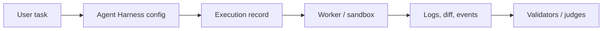

# Step 0 — Lock Execution Contract

Commit: `f526cd8`

This commit only added `testing/issue-462-agent-harness-executions.md`.

There is no Go code to explain in this commit. The important lesson is workflow:
before writing implementation, define what "done" means in concrete terms.

## Why This Matters

Large agent features drift easily. A GitHub issue may say "end-to-end execution",
but that can mean database state, worker orchestration, CLI commands, replay,
artifacts, scoring, UI, and auth.

The contract narrows this PR to a reviewable first slice:

- persist harness executions
- snapshot harness config
- expose start/list/get through API and CLI
- keep worker/E2B execution out of scope for now

## Agent Harness Concept

An agent harness is the runtime wrapper around an autonomous coding agent.

For Codex-on-E2B, the future full flow looks like:

This commit only creates the review contract for the `Execution record` part.

## Go Learning

No Go appears here, but this commit sets up a Go implementation habit:
write behavior in nouns and verbs before writing structs and methods.

That makes later Go code easier to design:

- nouns become structs, like `AgentHarnessExecution`
- verbs become methods, like `CreateAgentHarnessExecution`
- rules become tests, like workspace mismatch returning not found

## What To Review

Review whether the contract is honest about scope. It should not promise full
Codex execution yet, because the first implementation does not run E2B workers.
