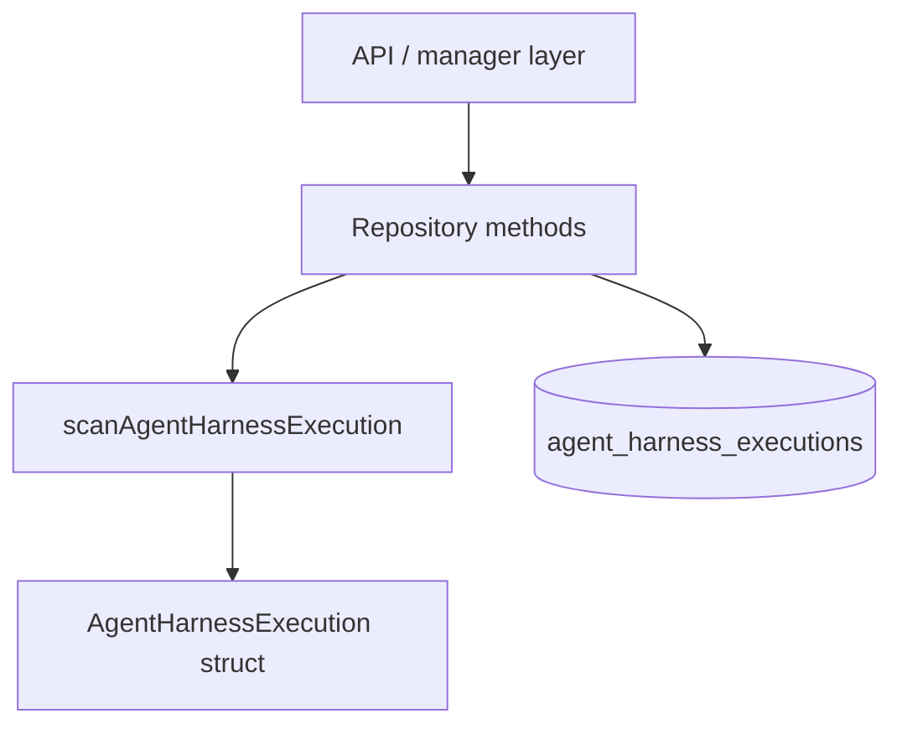

# Step 2 — Execution Repository Go Code

Commit: `2c60c7b`

File: `backend/internal/repository/agent_harness_executions.go`

## What This Go Code Adds

This commit creates the Go repository layer for Agent Harness executions.

In this codebase, a repository is the package that knows SQL. The rest of the
app should not scatter raw database queries everywhere. Instead, higher layers
call small methods like:

```go
CreateAgentHarnessExecution(ctx, params)
GetAgentHarnessExecutionByID(ctx, id)
ListAgentHarnessExecutions(ctx, params)
```

That is the core design: keep database access behind a Go API.

## The Main Struct

```go
type AgentHarnessExecution struct {
	ID                       uuid.UUID
	OrganizationID           uuid.UUID
	WorkspaceID              uuid.UUID
	AgentHarnessID           uuid.UUID
	CreatedByUserID          *uuid.UUID
	Status                   string
	HarnessSnapshot          json.RawMessage
	ExecutionConfigSnapshot  json.RawMessage
	EvaluationConfigSnapshot json.RawMessage
	ErrorMessage             *string
	StartedAt                *time.Time
	CompletedAt              *time.Time
	CancelledAt              *time.Time
	CreatedAt                time.Time
	UpdatedAt                time.Time
}
```

This struct is the in-memory Go shape of one database row.

Go concept: pointer fields mean optional values.

- `CreatedByUserID *uuid.UUID`: can be nil if the user is deleted or unknown.
- `StartedAt *time.Time`: nil means the execution has not started.
- `CompletedAt *time.Time`: nil means it has not completed.
- `ErrorMessage *string`: nil means no error.

Without pointers, Go would need fake zero values like `time.Time{}` or `""`,
which can be ambiguous.

## Why `json.RawMessage`

These fields are stored as raw JSON:

```go
HarnessSnapshot          json.RawMessage
ExecutionConfigSnapshot  json.RawMessage
EvaluationConfigSnapshot json.RawMessage
```

`json.RawMessage` is just `[]byte` with JSON meaning.

Why use it here?

- The repository does not need to understand every config field.
- It preserves the exact snapshot shape for auditability.
- Later scoring/worker code can interpret it without changing this repository.

AI engineering concept: snapshots matter because agent runs must be auditable.
If the harness definition changes tomorrow, yesterday's execution should still
show what config it actually used.

## Params Structs

```go
type CreateAgentHarnessExecutionParams struct { ... }
type ListAgentHarnessExecutionsParams struct { ... }
```

This is a common Go style: pass one params struct instead of many positional
arguments.

Good:

```go
CreateAgentHarnessExecution(ctx, CreateAgentHarnessExecutionParams{
	WorkspaceID: workspaceID,
	AgentHarnessID: harnessID,
})
```

Harder to read:

```go
CreateAgentHarnessExecution(ctx, orgID, workspaceID, harnessID, userID, a, b, c)
```

Params structs make call sites self-documenting and easier to extend later.

## `context.Context`

Every repository method takes `ctx context.Context`.

```go
func (r *Repository) GetAgentHarnessExecutionByID(ctx context.Context, id uuid.UUID) ...
```

Go concept: `context.Context` carries cancellation, deadlines, and request
scope. If an HTTP request is cancelled, the DB query can stop too.

Agent-platform concept: long-running systems need cancellation everywhere.
Eventually, harness execution may involve Temporal, workers, E2B, and logs.
Passing context consistently is how cancellation can flow through the stack.

## `QueryRow` vs `Query`

Create/get use `QueryRow`:

```go
row := r.db.QueryRow(ctx, `...`)
return scanAgentHarnessExecution(row)
```

List uses `Query`:

```go
rows, err := r.db.Query(ctx, `...`)
defer rows.Close()
```

Go/database concept:

- `QueryRow` expects one row.
- `Query` returns many rows and must be closed.

The `defer rows.Close()` is important. It releases the database cursor even if
the function returns early.

## The Scanner Interface

```go
type agentHarnessExecutionScanner interface {
	Scan(dest ...any) error
}
```

This is a tiny Go interface. Both `pgx.Row` and `pgx.Rows` have a `Scan` method,
so one helper can scan both single-row and multi-row results:

```go
func scanAgentHarnessExecution(scanner agentHarnessExecutionScanner) ...
```

Go concept: interfaces are satisfied implicitly. No type says "implements
agentHarnessExecutionScanner"; if it has `Scan(dest ...any) error`, it fits.

This keeps the code DRY without making a big abstraction.

## Error Translation

```go
if errors.Is(err, pgx.ErrNoRows) {
	return AgentHarnessExecution{}, ErrAgentHarnessExecutionNotFound
}
```

The repository converts a database-specific error into a domain-specific error.

Why?

- API code should not know about `pgx.ErrNoRows`.
- API code can map `ErrAgentHarnessExecutionNotFound` to HTTP 404.
- Tests become clearer.

SWE concept: translate low-level errors at module boundaries.

## Nil Slice Choice

```go
executions := make([]AgentHarnessExecution, 0)
```

This returns an empty slice instead of nil when there are no rows.

That is nicer for JSON APIs because `[]` is usually friendlier than `null`.

## Small But Important Helper

```go
func defaultRepositoryJSON(raw json.RawMessage) json.RawMessage {
	if len(raw) == 0 {
		return json.RawMessage(`{}`)
	}
	return raw
}
```

This protects inserts from accidentally storing empty JSON where the database
expects valid JSON.

Important layering point: this helper lives in the repository package because
the repository is the package doing the insert. It should not depend on an API
package helper.

## The Design In One Diagram



## What To Remember

- Structs model rows.
- Params structs make functions readable.
- `context.Context` lets cancellation flow.
- `json.RawMessage` is useful for opaque/auditable config.
- Tiny interfaces can remove duplication.
- Repositories should translate database errors into app errors.
