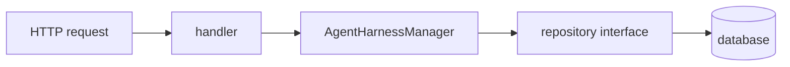

# Step 3 — Execution API Go Code

Commit: `16c6a28`

File focus:

- `backend/internal/api/agent_harnesses.go`
- `backend/internal/api/routes.go`
- `backend/internal/api/agent_harnesses_test.go`

## Core Idea

This commit turns repository methods into user-facing API behavior.

The new flow is:

Handlers parse HTTP. Managers enforce rules. Repositories store data.

## Interfaces

The commit extends `AgentHarnessRepository` and `AgentHarnessService`.

This lets API code depend on behavior instead of a concrete database type. Tests
can use fakes, while production uses the real repository.

## Manager Methods

`StartAgentHarnessExecution`:

- authorizes the workspace
- loads the harness
- verifies the harness belongs to that workspace
- snapshots harness/config data
- creates a queued execution

The workspace mismatch returns not found. That avoids leaking whether a harness
exists in another workspace.

`GetAgentHarnessExecution`:

- authorizes workspace
- loads execution
- checks workspace ownership
- returns not found on mismatch

`ListAgentHarnessExecutions`:

- authorizes workspace
- optionally validates `harness_id`
- lists executions scoped to workspace and optionally a harness

## Handlers

Handlers do HTTP-specific work:

- read caller/workspace from request context
- parse URL params with `uuid.Parse`
- call service methods
- map Go structs to JSON responses
- write HTTP errors

They should not contain deep business logic.

## Response Structs

The commit adds `agentHarnessExecutionResponse`.

This separates internal repository structs from public JSON shape. That is useful
because API JSON is a contract with clients, while repository structs are storage
models.

## Tests

The tests use fake repositories/services.

This teaches an important Go pattern: small interfaces make unit tests cheap.
You can test manager behavior without a real database.

Important tested behavior:

- starting execution snapshots harness config
- unauthorized caller cannot probe harness IDs
- workspace mismatch returns not found
- routes call the expected service methods

## SWE / AI Harness Lesson

This commit creates the control plane. It does not run Codex yet.

That split matters:

- API records intent
- worker later performs execution
- repository keeps durable state

Durable intent is how long-running agent systems survive retries, crashes, and
eventual worker orchestration.
