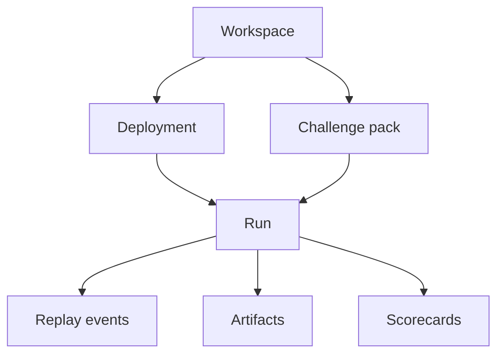

The AgentClash data model exists to answer one question cleanly: what exactly was run, against what workload, and what evidence did it produce?

## The core entities

At a high level, the schema revolves around a small set of concepts:

- workspaces: the ownership boundary for deployments and evaluation assets
- deployments: the runnable agent targets attached to a workspace
- challenge packs: repeatable workloads that define what should be attempted
- runs: concrete execution attempts
- replay events and artifacts: the evidence emitted while a run executes
- scorecards and comparisons: the summarized judgments built from that evidence

## Why the model is shaped this way

The schema is not just there to persist app state. It is there to preserve comparability.

If the system cannot answer these relationships clearly, the product falls apart:

- which workspace owned the evaluated deployment
- which workload definition the run used
- which evidence belongs to that run
- which summary or comparison was derived from that evidence

That is why the data model follows the execution model closely instead of hiding it behind generic analytics tables.

## What the schema needs to make cheap

Three classes of queries matter in practice:

- operator queries: what is currently running, stuck, or failing
- reviewer queries: why did this run score the way it did
- comparison queries: did the new deployment improve or regress on the same workload

The current schema diagrams and domain notes in the repo are already organized around that shape. They optimize for traceability first, not just storage convenience.

## Where to start in the repo

The most useful entry points are:

- `docs/database/schema-diagram.md` for the current entity map
- `docs/domains/domains.md` for domain-level language and ownership boundaries
- `backend/internal/api` for the read and write paths that expose those entities

## See also

- [Runs and Evals](../concepts/runs-and-evals)
- [Challenge Packs and Inputs](../concepts/challenge-packs-and-inputs)
- [Replay and Scorecards](../concepts/replay-and-scorecards)
- [Overview](../architecture/overview)
