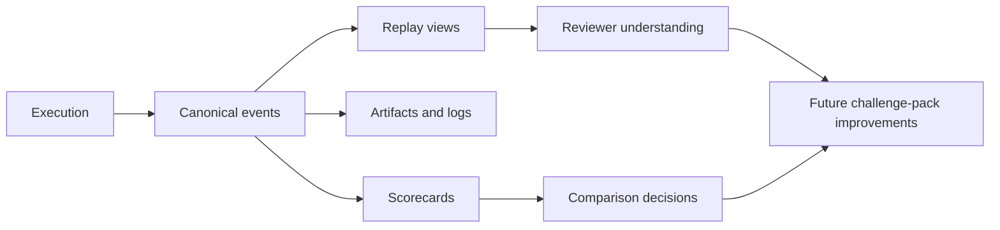

The evidence loop is the path that turns a finished run into something you can replay, score, compare, and learn from later.

## Why this loop matters

The hardest part of agent evaluation is not running one experiment. It is preserving enough evidence to make the next experiment smarter.

AgentClash leans on a canonical event model so the same execution can feed multiple consumers:

- a live or replayable timeline
- artifacts and logs for detailed inspection
- scorecards for compact judgments
- future workload design when a failure is worth preserving

## The canonical event envelope is the hinge

The replay docs in the repo make this explicit: if different subsystems emit ad-hoc logs, you cannot build a trustworthy replay or comparison layer on top. The canonical event envelope is the normalization step that keeps evidence portable.

That gives AgentClash a cleaner stack:

- execution code emits structured events
- the UI can render those events as a timeline
- scoring can summarize those events without losing the underlying trail
- later analysis can reuse the same evidence instead of scraping logs again

## Why scorecards should not replace evidence

A scorecard is the summary, not the truth source. Treat it as the decision layer that sits on top of replay and artifacts. When there is disagreement about a result, the replay and artifact trail should still be there to settle it.

That is the practical reason this loop exists. It keeps ranking and triage honest.

## Where to start in the repo

- `docs/replay/canonical-event-envelope.md` for the event model
- `docs/evaluation/challenge-pack-v0.md` for how useful failures become future workloads
- `web/src/app` for the frontend surfaces that consume replay and results

## See also

- [Replay and Scorecards](../concepts/replay-and-scorecards)
- [Interpret Results](../guides/interpret-results)
- [Data Model](../architecture/data-model)
- [First Eval](../getting-started/first-eval)
