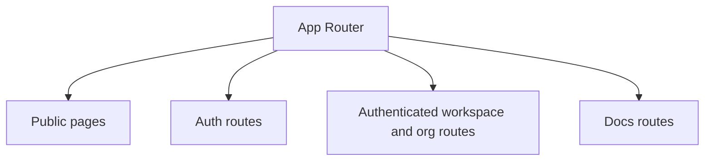

The web app is not just the dashboard. It currently carries the product landing pages, AuthKit-based auth flows, authenticated workspace routes, the blog, and the docs surface.

## Route split

## Public pages

The landing page, team page, blog, and docs live in the same Next.js app so they can share typography, branding, and deployment infrastructure. The docs implementation deliberately reuses the same MDX stack already used by the blog instead of adding a second docs framework right away.

## Authenticated app routes

The authenticated product surfaces live under workspace and organization routes and are guarded by WorkOS AuthKit. That split matters for docs because the docs surface needs to stay public even when local WorkOS env is not configured.

## Docs-specific decision

The docs route is now treated as public and bypasses the AuthKit middleware path. That keeps `/docs` reachable in local development and in environments where the docs should be browsable without login.

## Why keep docs in the existing app

For this stage of the product, keeping docs inside the current Next.js app is the pragmatic move:

- no second frontend deployment stack
- reuse of existing fonts, theme tokens, and MDX tooling
- one place to link from product pages into docs

If the docs surface later needs versioning, heavy search, or separate publishing workflows, moving to a more specialized framework still stays open.

## Code pointers

- `web/src/app`
- `web/src/middleware.ts`
- `web/src/lib/blog.ts`
- `web/src/lib/docs.ts`

## See also

- [Architecture Overview](/docs/architecture/overview)
- [Hosted Quickstart](/docs/getting-started/quickstart)
