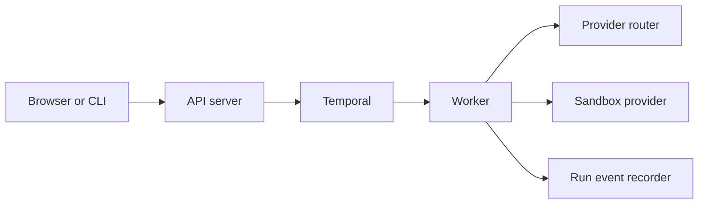

AgentClash models long-running execution as workflow work, not as a single API request that tries to stay alive forever.

## The runtime split

## What the API server does

The API server handles authentication, authorization, request validation, and persistence setup. For run creation, it wires the request into a Temporal workflow starter rather than trying to execute the whole run inline inside the HTTP handler.

That keeps the API server responsive and gives the platform a durable handoff point for work that may outlive the incoming request.

## What the worker does

The worker connects to Temporal, Postgres, the provider router, and the sandbox provider. It owns the expensive part of the system:

- provider calls
- sandbox-backed execution
- event emission
- result persistence

The worker also decides whether sandbox execution is really available. In the current code, `SANDBOX_PROVIDER=unconfigured` is a valid boot mode, which is why local run creation can succeed even when full native execution is not available.

## Why Temporal is load-bearing here

Run execution is exactly the category of problem where retries, timeouts, cancellation, and partial progress stop being “nice to have” as soon as you leave toy demos. Temporal gives AgentClash a durable workflow backbone so the API server can enqueue work, the worker can resume it, and failures can be handled with explicit workflow semantics instead of improvised queue glue.

## Code pointers

- `backend/cmd/api-server/main.go`
- `backend/cmd/worker/main.go`
- `backend/internal/worker`
- `backend/internal/workflow`

## See also

- [Architecture Overview](/docs/architecture/overview)
- [Frontend Architecture](/docs/architecture/frontend)
