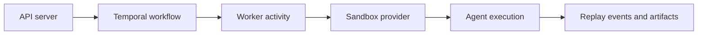

The sandbox layer is the execution boundary between AgentClash orchestration and the environment where an agent actually runs.

## Why the sandbox boundary exists

The workflow engine should decide what to run and when to retry. It should not directly own process isolation, filesystem risk, network policy, or provider-specific runtime setup. Those concerns change at a different rate and carry a different failure model.

That is why the architecture keeps a boundary between orchestration and execution:

- the API decides that a run should exist
- Temporal workflows coordinate the lifecycle
- the worker performs execution work
- the sandbox provider supplies isolation for the runnable target

## Why E2B is the current fit

The current local-development and worker docs show E2B as the concrete provider in use today. That gives AgentClash a managed isolation layer without having to invent a bespoke container orchestration story inside the app itself.

The main benefits are straightforward:

- isolation is handled outside the web and API processes
- runtime setup is explicit and configurable through worker environment
- the provider can be swapped later without rewriting the product model around runs and evidence

## What this boundary protects

This is not only about security. It is also about keeping failure domains honest.

When a run fails, you want to know whether the issue belongs to:

- the scheduler
- the worker logic
- the sandbox provider
- the agent itself

A clean sandbox boundary makes that diagnosis easier because provider setup and execution failures do not get mixed into the same code path as API concerns.

## What to read in the code

Start with these files and directories:

- `backend/internal/worker/config.go` for sandbox-related environment surface
- `backend/internal/worker` for worker-side execution behavior
- `docs/worker/local-development.md` for how the local stack expects the provider to be configured

## Why not bake execution directly into the web or API app

Because that would collapse the concerns that need to stay separate. You would tie request handling, orchestration, and risky execution into the same operational surface. That is faster for a demo and worse for a real evaluation platform.

## See also

- [Orchestration](../architecture/orchestration)
- [Evidence Loop](../architecture/evidence-loop)
- [Self-Host](../getting-started/self-host)
- [Config Reference](../reference/config)
