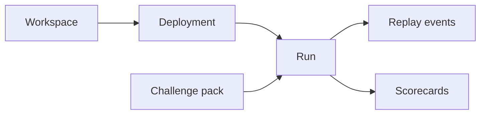

A deployment is the concrete runnable target that AgentClash can schedule into a run.

<Callout type="warning">
  The deployment surface is still evolving. Treat the current docs as a model
  for how the system is shaped today, not a frozen 1.0 contract.
</Callout>

## Why AgentClash talks about deployments

Most evaluation tools stop at the model name. AgentClash has to be stricter than that because it needs to run the same thing repeatedly, under the same constraints, and compare the resulting evidence. A deployment is the unit that gives the platform that stability.

In practice, a deployment answers questions like these:

- What agent should be invoked for this run?
- Which workspace owns that runnable target?
- Which credentials or backing provider settings are attached?
- Which challenge packs is the deployment expected to handle?

That is why the docs separate the idea of an "agent" from the thing the scheduler can actually execute. The agent is the product concept. The deployment is the runnable contract.

## The lifecycle from workspace to run

A typical flow looks like this:

The workspace owns the deployment. A run then combines that deployment with a challenge pack or other eval input. From there the worker executes the attempt, streams canonical events, and stores the evidence needed for scoring and replay.

The important part is reproducibility. If two runs claim to compare the same deployment, they need to point at the same runnable target, not just the same marketing label.

## What is stable today

The repo already reflects the existence of workspaces, deployments, challenge packs, and runs. You can see this in the CLI flow and the current docs/build notes:

- the CLI expects you to select a workspace before creating runs
- local and staging walkthroughs assume challenge packs and deployments already exist
- the current architecture separates orchestration from execution so a run can target a concrete deployment repeatedly

What is still moving is the exact shape of the deployment surface, especially around provider-specific configuration and richer setup workflows.

## How to think about provider configuration

The clean mental model is this:

- provider details are implementation details
- the deployment is the stable runtime handle
- the run binds that deployment to an input workload

That keeps the user-facing evaluation model simple. You compare runs and evals. Under the hood, AgentClash still knows which runnable target produced those results.

## See also

- [Runs and Evals](../concepts/runs-and-evals)
- [Challenge Packs and Inputs](../concepts/challenge-packs-and-inputs)
- [First Eval](../getting-started/first-eval)
- [CLI Reference](../reference/cli)
