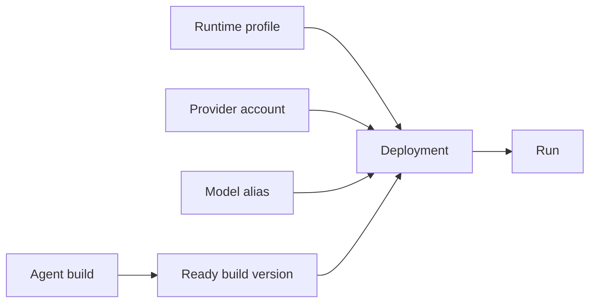

A deployment is the workspace-scoped runnable target that AgentClash can attach to a run.

## Why a deployment exists at all

AgentClash is stricter than a typical playground because it has to compare like with like. A model name by itself is not enough. The scheduler needs a concrete object that says:

- which build is being run
- which build version is current
- which runtime policy applies
- which provider credentials or model mapping are attached

That concrete object is the deployment.

## The current creation contract

The current API schema for `CreateAgentDeploymentRequest` requires:

- `name`
- `agent_build_id`
- `build_version_id`
- `runtime_profile_id`

It also supports these optional fields:

- `provider_account_id`
- `model_alias_id`
- `deployment_config`

The OpenAPI description also says only ready build versions can be deployed.



## Runtime profiles are the execution envelope

A runtime profile defines how aggressive or constrained execution should be. In the current API and web types, a runtime profile carries fields like:

- `execution_target`
- `trace_mode`
- `max_iterations`
- `max_tool_calls`
- `step_timeout_seconds`
- `run_timeout_seconds`
- `profile_config`

That last field matters. The native executor reads runtime-profile sandbox overrides from `profile_config`, including things like filesystem roots and `allow_shell` or `allow_network` toggles.

The clean mental model is:

- the challenge pack defines what the workload wants
- the runtime profile defines execution ceilings and local overrides
- the deployment binds those choices to a runnable target

## Provider accounts are how credentials enter the system

A provider account is a workspace resource with:

- `provider_key`
- `name`
- `credential_reference`
- optional `limits_config`

The important detail is how credentials are stored.

If you create a provider account with a raw `api_key`, the infrastructure manager stores that value as a workspace secret and rewrites the credential reference automatically to:

```text
workspace-secret://PROVIDER_<PROVIDER_KEY>_API_KEY
```

So the product already prefers indirection over plaintext credentials on the resource itself.

## Model aliases are not just display sugar

The user question usually comes out as “provider alias” or “model alias.” In the current product surface, the real resource is `model alias`.

A model alias maps a workspace-friendly key to a model catalog entry, and can optionally be tied to a provider account. The current fields are:

- `alias_key`
- `display_name`
- `model_catalog_entry_id`
- optional `provider_account_id`

That gives you a stable name inside the workspace even if the underlying provider model identifier is ugly or if you need multiple account-specific mappings.

## A deployment is where these pieces come together

A good way to think about the chain is:

- agent build version: what logic is being deployed
- runtime profile: how it is allowed to execute
- provider account: which credentials or spend limits back external model calls
- model alias: which model selection the deployment should use consistently
- deployment: the runnable handle used by runs

This is why the docs should not collapse deployment into “selected model.” The object is richer than that.

## What the UI and CLI expose today

The current repo already exposes the resource model across multiple surfaces:

- CLI `deployment create` and `deployment list`
- workspace pages for runtime profiles, provider accounts, model aliases, deployments, secrets, and tools
- run creation UI that asks for challenge pack and deployment selection separately

That separation is deliberate. A run is an execution event. A deployment is reusable infrastructure state.

## What is stable versus still moving

The stable part is the dependency chain and the API surface. The still-moving part is how richly each resource is edited in the UI and how much automation exists around them.

So the right docs posture is:

- document the current fields and flows precisely
- avoid pretending the deployment UX is fully polished
- treat the resource model itself as real and important

## See also

- [Configure Runtime Resources](../guides/configure-runtime-resources)
- [Challenge Packs and Inputs](../concepts/challenge-packs-and-inputs)
- [Tools, Network, and Secrets](../concepts/tools-network-and-secrets)
- [CLI Reference](../reference/cli)
