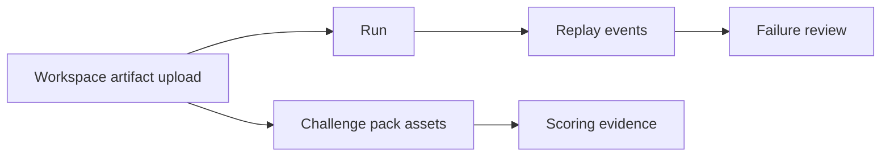

An artifact is a stored file object that AgentClash can keep at workspace scope, attach to runs, reference from challenge packs, and expose through signed downloads.

## What an artifact is in the current product

The current artifact response shape already tells you the core model:

- `workspace_id`
- optional `run_id`
- optional `run_agent_id`
- `artifact_type`
- optional `content_type`
- optional `size_bytes`
- optional `checksum_sha256`
- `visibility`
- `metadata`
- `created_at`

That means artifacts are not only run outputs. They can exist before a run and be used as reusable workspace context.

## There are two important artifact roles

### 1. Workspace-managed files

The workspace UI and API let you upload arbitrary files to the workspace artifact store.

The current artifacts page describes them as files you can:

- use as context in challenge packs
- attach to runs

That is the right mental model. Upload once, then reuse where it makes sense.

### 2. Run evidence files

Runs and replay events can also point at artifacts. Those become part of the evidence trail for later inspection, scoring, or failure review.

That is why replay and failure-review models carry artifact references. Artifacts are part of the audit trail, not just incidental attachments.

## Challenge-pack assets and artifact refs

Challenge packs do not embed giant blobs directly into YAML. They declare assets and then refer to them by key.

The bundle model supports assets at multiple levels:

- `version.assets`
- `challenge.assets`
- `case.assets`

Each asset can carry:

- `key`
- `path`
- `kind`
- `media_type`
- optional `artifact_id`

Then other parts of the pack can reference those declared assets using:

- `artifact_refs`
- `artifact_key`
- expectation sources like `artifact:<key>`

Validation already checks that those references are real. If the key or artifact ID does not resolve, validation fails before publish.

## The published bundle is itself tracked as an artifact

When you publish a challenge pack, the response may include `bundle_artifact_id`.

That is an important detail because it means the authored pack bundle is treated as a stored object of record. The product does not only store parsed rows; it can also retain the published source bundle as an artifact.

## Upload and download flow

The current API surface is:

- `GET /v1/workspaces/{workspaceID}/artifacts`
- `POST /v1/workspaces/{workspaceID}/artifacts`
- `GET /v1/artifacts/{artifactID}/download`
- public content route at `/artifacts/{artifactID}/content`

The upload path is multipart and supports:

- `file`
- `artifact_type`
- optional `run_id`
- optional `run_agent_id`
- optional `metadata`

The download flow is intentionally indirect. The API returns a signed URL and expiry, then the actual file content is served through the public content endpoint. That keeps raw artifact content behind signed access rather than exposing direct permanent object URLs.

## Visibility and metadata matter

Artifacts also carry `visibility` and arbitrary JSON `metadata`.

The current UI uses metadata to recover nicer names like `original_filename`. If no filename metadata exists, it falls back to showing the artifact ID prefix.

That sounds minor, but it is a sign that metadata is a first-class part of the artifact model, not just a debug dump.

## When to use artifacts versus inline YAML data

Use inline bundle data when:

- the value is small
- it belongs directly in the challenge definition
- you want the pack to stay self-contained

Use artifacts when:

- the file is large or binary
- you want reuse across packs or runs
- the same file should be downloadable later
- the evidence trail should preserve it as a named object

## See also

- [Challenge Packs and Inputs](../concepts/challenge-packs-and-inputs)
- [Write a Challenge Pack](../guides/write-a-challenge-pack)
- [Evidence Loop](../architecture/evidence-loop)
- [Data Model](../architecture/data-model)
