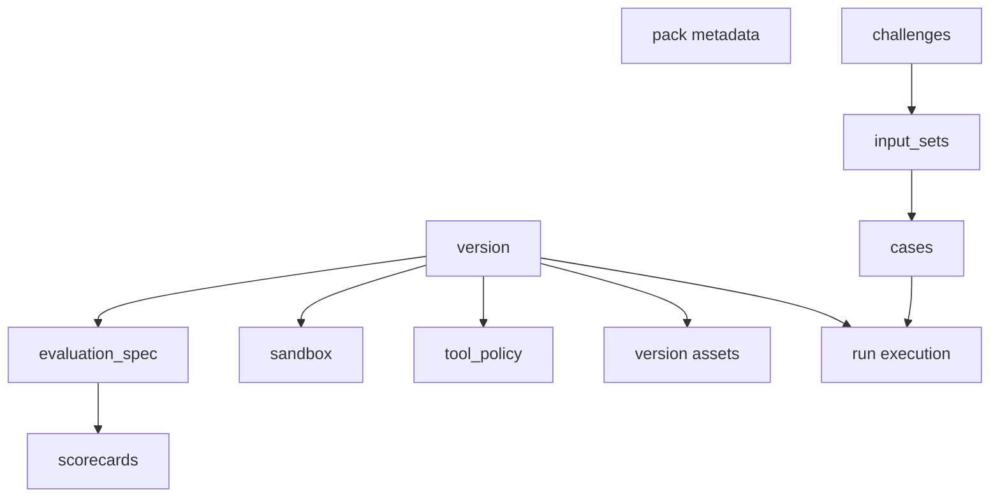

A challenge pack is a versioned YAML bundle that defines the workload, scoring contract, execution policy, and input sets for a repeatable evaluation.

## What makes it a challenge pack instead of a prompt

A challenge pack is not just a task description. In the current repo, a runnable pack carries enough structure for AgentClash to do four jobs consistently:

- execute the same workload again later
- attach one or more deployments to that workload
- score the result using a versioned evaluation spec
- preserve the relationship between a failed case and the evidence that exposed it

That is why the API does not ask you to start a run with a loose prompt blob. It asks for a `challenge_pack_version_id`.

## The current bundle shape

The parser in `backend/internal/challengepack/bundle.go` expects a YAML bundle with these top-level sections:

- `pack`: human metadata like `slug`, `name`, and `family`
- `version`: the executable version block
- `tools`: optional pack-defined composed tools
- `challenges`: the workload definitions
- `input_sets`: the concrete runnable cases

A pack becomes runnable through its `version` block. That block currently carries the load-bearing execution data:

- `number`: the pack version number
- `execution_mode`: `native` or `prompt_eval`
- `tool_policy`: allowed tool kinds and runtime toggles
- `filesystem`: optional filesystem constraints
- `sandbox`: network, env, package, and template configuration
- `evaluation_spec`: the scoring contract
- `assets`: version-scoped files or artifact references



## Challenge, input set, case, and asset are different things

These terms are easy to blur together. Do not blur them.

- challenge pack: the entire versioned bundle
- challenge: one task definition inside the bundle
- input set: one named collection of runnable cases for that pack version
- case: one concrete workload item tied to a challenge via `challenge_key`
- asset: a file-like dependency declared by key and path, optionally backed by a stored artifact ID

The bundle model in the repo uses `input_sets[].cases[]` as the main execution unit. A case can carry:

- `payload`
- structured `inputs`
- structured `expectations`
- `artifacts`
- case-local `assets`

That makes cases more expressive than a single flat prompt. They can reference files, expected outputs, and evaluator inputs without inventing an ad-hoc schema per benchmark.

## The evaluation spec is part of the pack, not global product config

The current evaluation docs are explicit about this. The scoring contract lives inside the pack version’s manifest. That means the pack defines:

- validator keys and types
- metrics and collectors
- runtime limits
- pricing rows used for cost scoring
- scorecard dimensions and normalization thresholds

This matters because AgentClash needs scorecards to remain auditable. When a run is scored, the product can persist the exact `evaluation_spec_id` that was used. The publish response already returns that ID.

## Execution mode matters

Two execution modes are visible in the current code and examples:

- `prompt_eval`: lighter-weight packs that focus on prompt-style evaluation
- `native`: packs that can carry sandbox, tool, and execution policy for richer runs

You should choose the simpler mode unless the workload really needs a sandbox, files, or tool execution.

## Sandbox, tool policy, and internet access belong to the pack version

This is one of the most important design choices in the repo.

The pack version can say what the evaluator is allowed to do:

- which tool kinds are allowed
- whether shell or network access is enabled
- what network CIDRs are allowed
- which additional packages should exist in the sandbox
- which env vars are injected as literal values

In other words, the pack is not only content. It is also policy.

## Assets and artifact-backed packs

The version block, challenge blocks, and case blocks can all reference assets. Each asset has a `key` and `path`, and may also carry `media_type`, `kind`, or `artifact_id`.

That gives you two useful authoring patterns:

- check small fixtures into the pack and refer to them by path
- attach previously uploaded workspace artifacts and refer to them by `artifact_id`

Validation already checks that asset references are real. If a case or expectation points at an artifact key that was never declared, publish-time validation fails.

## Publish and validate are first-class workflow steps

The API and CLI already expose the authoring loop directly:

- validate with `POST /v1/workspaces/{workspaceID}/challenge-packs/validate`
- publish with `POST /v1/workspaces/{workspaceID}/challenge-packs`
- list packs with `GET /v1/workspaces/{workspaceID}/challenge-packs`
- list published input sets with `GET /v1/workspaces/{workspaceID}/challenge-pack-versions/{versionID}/input-sets`

The CLI mirrors that with:

```bash
agentclash challenge-pack validate <file>
agentclash challenge-pack publish <file>
agentclash challenge-pack list
```

Publish returns more than a pack ID. It returns:

- `challenge_pack_id`
- `challenge_pack_version_id`
- `evaluation_spec_id`
- `input_set_ids`
- optional `bundle_artifact_id`

That tells you the pack bundle is treated as a concrete artifact of record, not just transient YAML.

## How a pack becomes a run

A run binds:

- one `challenge_pack_version_id`
- one or more deployment IDs
- optionally one selected input set

From there the worker resolves the pack manifest, execution policy, assets, and scoring contract into the runtime path.

That is why challenge packs are foundational in AgentClash. They are the unit that makes two runs comparable without hand-waving.

## See also

- [Write a Challenge Pack](../guides/write-a-challenge-pack)
- [Agents and Deployments](../concepts/agents-and-deployments)
- [Tools, Network, and Secrets](../concepts/tools-network-and-secrets)
- [Artifacts](../concepts/artifacts)
