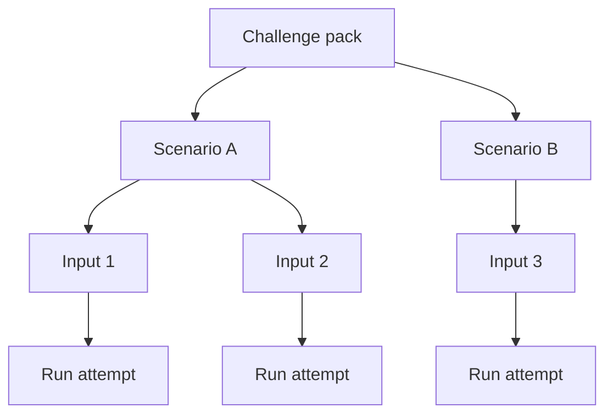

A challenge pack is the repeatable workload definition that tells AgentClash what to run, against which inputs, and how to interpret the resulting evidence.

## Why challenge packs exist

A single prompt or one-off run is not enough to tell you whether an agent is improving. AgentClash needs a package of work that can be rerun, compared, and discussed without argument about the setup. That is what the challenge pack is for.

From the current evaluation docs, the load-bearing idea is not just "a scenario". It is a bundle that includes the task definition, the input set, and the scoring context around that task. That gives you three useful properties:

- repeatability: the same workload can be rerun after code or prompt changes
- comparability: two deployments can be graded against the same workload
- traceability: when a run fails, you can tie the failure back to a concrete case

## Pack, scenario, and input are different things

These terms are easy to blur together, so keep them separate:

- challenge pack: the top-level container for a repeatable eval workload
- scenario: the task pattern or rules an agent is being judged against
- input: the concrete example or case that turns a scenario into an actual run attempt

When you look at results, this distinction matters. A weak score can come from one bad input, one brittle scenario, or a deployment that underperforms across the whole pack.

## What the pack needs to carry

The current challenge-pack design notes point toward a few pieces that matter in practice:

- metadata so humans know what the workload is supposed to test
- the input set that actually drives the run fan-out
- scoring or judgment context so results can be turned into something comparable
- enough structure to promote good examples into regression workloads later

That last part matters more than it sounds. In a serious eval system, good challenge packs are built from real failures, not invented in isolation.

## How this shows up in a run

A run is where the abstract pack becomes concrete. The run binds:

- one deployment
- one workload definition
- one concrete execution attempt per input or case

That means you can ask precise questions later:

- Did this deployment fail one input or the whole pack?
- Did the replay show a sandbox failure, tool failure, or agent reasoning failure?
- Did a new build improve the median score but regress one important scenario?

## See also

- [First Eval](../getting-started/first-eval)
- [Replay and Scorecards](../concepts/replay-and-scorecards)
- [Interpret Results](../guides/interpret-results)
- [Runs and Evals](../concepts/runs-and-evals)
