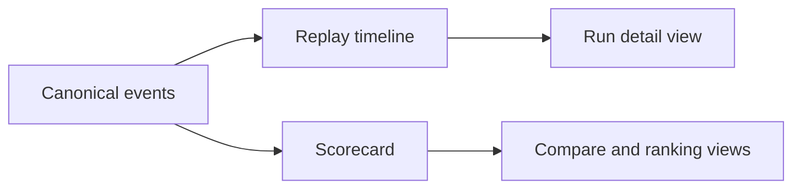

Replay is the ordered event history of a run. Scorecards are the condensed judgments and summaries built from that evidence.

## Why AgentClash stores both

If you only keep a final score, you lose the explanation. If you only keep raw logs, nobody can compare anything quickly. AgentClash needs both because the product is about arguing from evidence, not from vibes.

The canonical event envelope work in the repo makes that boundary explicit. Execution emits structured events. The frontend and downstream analysis layers can replay those events as a timeline. Scorecards then turn the same evidence into something compact enough to rank, filter, and compare.

## Replay is the source of truth

Think of replay as the forensic record. It answers questions like:

- what happened first
- when the agent called a tool
- when the sandbox or infrastructure layer failed
- when artifacts or outputs were produced
- what the final terminal state was

That is why replay data should be preserved even when the top-line score looks obvious. The run may still teach you something the score alone cannot show.

## Scorecards are the decision layer

A scorecard should make a run legible in seconds. The exact schema will keep evolving, but the purpose is stable:

- summarize whether the run passed, failed, or degraded
- attach the evidence that justifies that judgment
- make comparisons across runs possible without rereading the full trace

## How to use both together

The fastest useful workflow is:

1. start with the scorecard to see whether the run is healthy
2. move to the replay timeline to understand why
3. inspect artifacts when the failure is ambiguous or multi-step
4. compare against another run only after you trust the evidence on each side

That sequence sounds basic, but it prevents a common failure mode: overreacting to a single score change without checking whether the underlying run actually exercised the same path.

## See also

- [Interpret Results](../guides/interpret-results)
- [Evidence Loop](../architecture/evidence-loop)
- [Challenge Packs and Inputs](../concepts/challenge-packs-and-inputs)
- [Data Model](../architecture/data-model)
