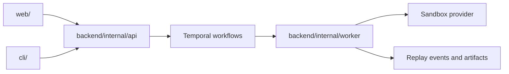

This repo is easier to navigate if you follow the runtime path instead of reading directories alphabetically.

## Start with the product surfaces

The main user-facing modules are:

- `web/`: the Next.js product site, authenticated app, and docs surface
- `cli/`: the standalone Go CLI used against local or hosted backends
- `backend/`: API and worker-side Go services
- `docs/`: deeper architecture, build-order, replay, and local-development notes

If you only remember one thing, remember this: the web app is not the whole product. AgentClash is a multi-service system with a CLI and a workflow engine behind it.

## Follow a run from request to evidence

A useful mental path through the repo is:

That is the shortest route from "user action" to "why did this run behave that way".

## Where to look for common tasks

### I need to change the web UX

Start in `web/src/app` for routes and page entry points, then `web/src/components` for the shared UI.

### I need to change auth or API behavior

Start in `backend/internal/api` and trace the handler path from request shape to domain logic.

### I need to change execution behavior

Start in `backend/internal/worker` and the orchestration docs so you understand what the workflow owns versus what the activity owns.

### I need to change local or hosted CLI behavior

Start in `cli/cmd` for command surface and `cli/internal` for config and supporting behavior.

### I need product context before I code

Start in `docs/` instead of guessing. The build-order, domain, replay, and database notes are there for a reason.

## A practical reading order for new contributors

1. Read [Setup](../contributing/setup).
2. Read [Overview](../architecture/overview).
3. Read [Orchestration](../architecture/orchestration).
4. Skim `docs/domains/domains.md` and `docs/database/schema-diagram.md`.
5. Only then start changing handlers, workflows, or UI.

That order is faster than diving straight into implementation files without the system model in your head.

## See also

- [Setup](../contributing/setup)
- [Testing](../contributing/testing)
- [Overview](../architecture/overview)
- [Frontend](../architecture/frontend)
